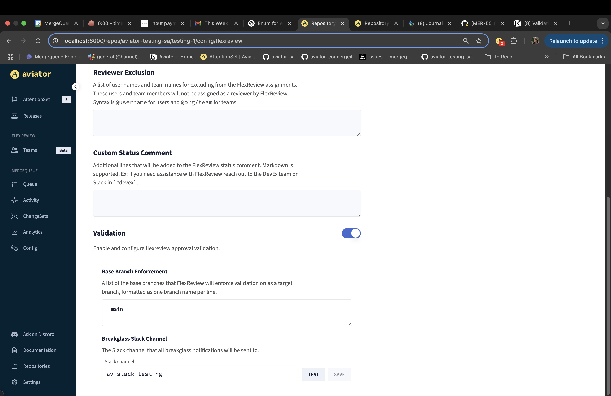

# Getting Started with FlexReview

FlexReview is a low-config tool that uses pull request history to dynamically understand code ownership.

### Step 1: Connect

During the initial setup, you will be asked to connect the Aviator GitHub app to your GitHub repository to use FlexReview.&#x20;

<figure><figcaption></figcaption></figure>


If you have trouble connecting the app, please read the [<mark style="color:blue;">troubleshooting doc</mark>](../manage/faqs/troubleshooting-github-app-connection.md).


### Step 2: Activate

At this point, you can choose the repository you want to start with. When activating FlexReview on a GitHub repository, it'll be enabled in the [<mark style="color:blue;">**read-only mode**</mark>](broken-reference). That means, FlexReview won't interact with any PRs directly, but you will be able to use the slash commands. This gives you an opportunity to fine-tune and test out FlexReview before turning on the automation.

<figure><figcaption></figcaption></figure>

### Step 3: Ensure indexing is complete

FlexReview make take a few minutes to index some teams and pull request data from your repository. To review the status go to the specific repository that you activated from the "Repositories" section in the Aviator Dashboard. Select FlexReview > Configure.

Once the indexing is complete, you should see the status saying that the indexing is finished.

<figure><figcaption>
Indexing complete
</figcaption></figure>

FlexReview processes the last 1 year of the results, but you can also start testing it out after waiting a few minutes as the scores and calculations will start working once some of the data is indexed.


If it takes longer than 60 minutes to index the initial data, please try refreshing the page, or contact us at **howto@aviator.co.**


### Step 4: Test suggestions

Once indexed, you should be able to test out the suggestions. Remember that the suggestions here are still imperfect since FlexReview has only completed initial indexing. The full indexing continues in the background.\

Use the Slash command in GitHub comments to get suggestions directly in your pull request view.

<figure><figcaption></figcaption></figure>

### Step 5: Picking the Team

FlexReview requires minimal configuration. Once you have tested Aviator FlexReview manually using Slash commands, you can start activating it for specific teams in your organization. Once activated, you can now go to the Team config and set up the reviewer assignment rules and optionally define the SLOs and the automated actions. All subsequent pull requests that modify the code owned by this team will start seeing reviewer suggestion comments and assign reviewers based on the configured policy.

### Step 6: Enabling FlexReview Validation

[FlexReview Validation](concepts/validation-in-flexreview.md) enhances code reviews by validating the required approvals for a pull request based on file ownership and selectively dismisses reviewers based on file changes. It can be enabled through the FlexReview configuration page and will add a status check to all pull requests. This pull request can then be made a required check for merging.

First, go to your repository's FlexReview configuration page and enable validation:

<figure><figcaption>
Configuring FlexReview.
</figcaption></figure>

<figure><figcaption>
Validation is enabled at the bottom of the configuration page.
</figcaption></figure>

Then, in GitHub, add Aviator FlexReview as a required check in your branch ruleset:

<figure><figcaption>
The "require status checks to pass" option on GitHub's branch rulesets page.
</figcaption></figure>

<figure><figcaption>
An aviator/flexreview status check in GitHub.
</figcaption></figure>

To enable selective reviewer dismissal, make sure the setting “dismiss all approvals on push” is disabled in GitHub's branch protection rules. More information can be found in [How to Set Up FlexReview Validation](how-to-guides/how-to-set-up-flexreview-validation.md).

To learn more about how FlexReview works, please read the [Concepts](concepts/) and [How-to-guides](../releases-beta/how-to-guides/) and check out the complete [reference guide](reference/) to understand all the configurations.

If you have any questions or comments, please reach out to **howto@aviator.co**
