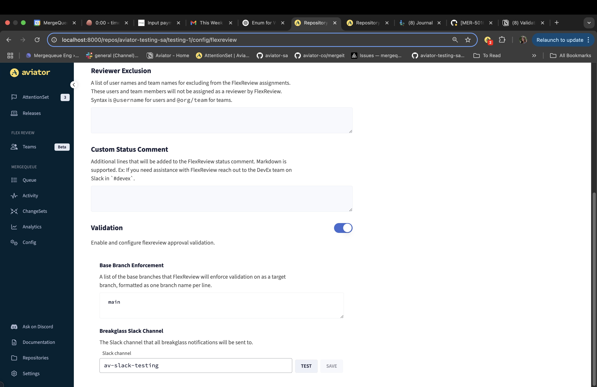
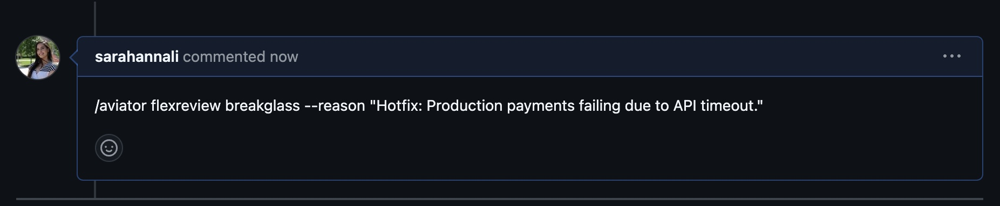

# How to Set Up FlexReivew Validation

### **How to Enable FlexReview Validation**

FlexReview validation can be enabled in the FlexReview repository-level settings of a specific repo:

<figure><figcaption>
Configuring FlexReview.
</figcaption></figure>

<figure><figcaption>
Validation is enabled at the bottom of the configuration page.
</figcaption></figure>

To use FlexReview Validation, add the relevant base branches to your FlexReview repository-level configuration. This ensures that:

* Validation applies only to pull request targeting these specified branches.
* Isolated branches are excluded from Validation.

You can also configure what slack channel break-glass override notifications will be sent to.

#### GitHub changes

* When configuring FlexReview Validation, you should move you GitHub Codeowners file to Aviator Owners file to avoid GitHub overriding the validation settings
* In GitHub branch protection rules, make sure the setting “dismiss all approvals on push” is disabled.

## **Break-Glass Functionality**

In case of emergency merges, FlexReview Validation can be overridden by commenting on the pull request:

<figure><figcaption></figcaption></figure>

Once this comment is posted:

* The PR will only require a single general approval from any user to be merged.
* A Slack notification will be sent to a designated channel to inform the team of the override.
