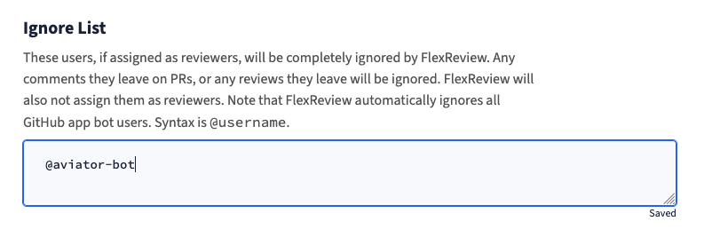

# Expert scoring algorithms

## Expert scores

FlexReview’s reviewer suggestion and expert review requirements are based on expert scores. The score is calculated for every user and for every file based on the file modification history.

<figure><figcaption>
Public domain: https://commons.wikimedia.org/wiki/File:ForgettingCurve.svg
</figcaption></figure>

This score calculation logic takes into account many factors. However, we are taking a simple approach that is based on the [<mark style="color:blue;">Forgetting curve</mark>](https://en.wikipedia.org/wiki/Forgetting_curve). The forgetting curve shows how much information / memory is lost over the time in human’s memory. We apply this to the GitHub pull request code authoring and reviewing history. This allows us to build an estimator that reflects both recency and accumulated knowledge based on the past contributions.

## Review load

Review load for a user is basically calculated as "number of PRs interacted in the past week", but we add a modification to it.

<figure><figcaption></figcaption></figure>

Whenever a user interacts with a PR (e.g. leaving a review / comment), the user is considered to have 1 review load. This number decreases over time for 7 days. For example, when a user leaves a review for a PR, that adds 1 review load. After 3.5 days have passed, the review load is decreased to 0.5 for that PR. This review load counting is done per PR and user, and the review load for a user at any point is sum of those PR-User load. This way, the review load of a person will gradually change rather than abruptly going up and down.

## Expert load-balancing

Expert load-balancing is an assignment method that combines expertise assignment and load-balancing assignment.

<figure><figcaption></figcaption></figure>

Based on the expert scores of the users, we make two clusters of the users; high score users and low score users. Among the high score users, it assigns a reviewer to balance out the review loads.
