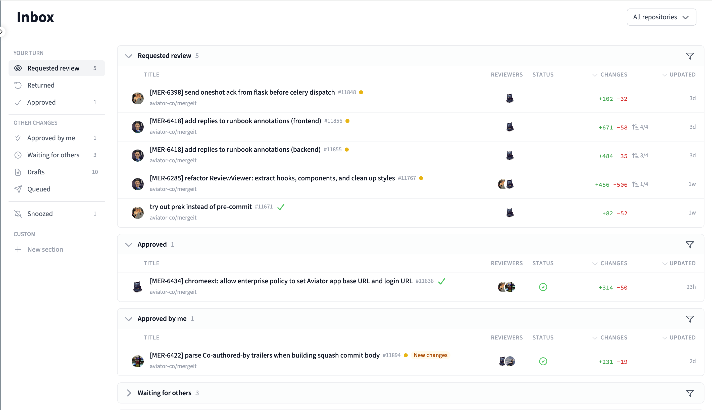
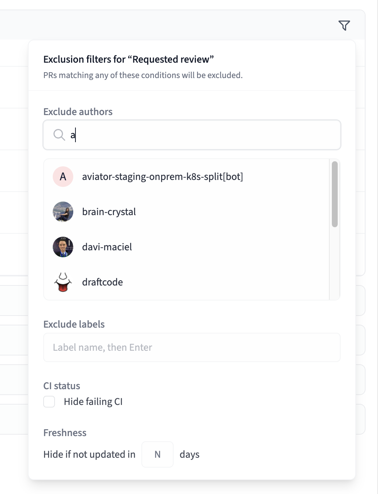
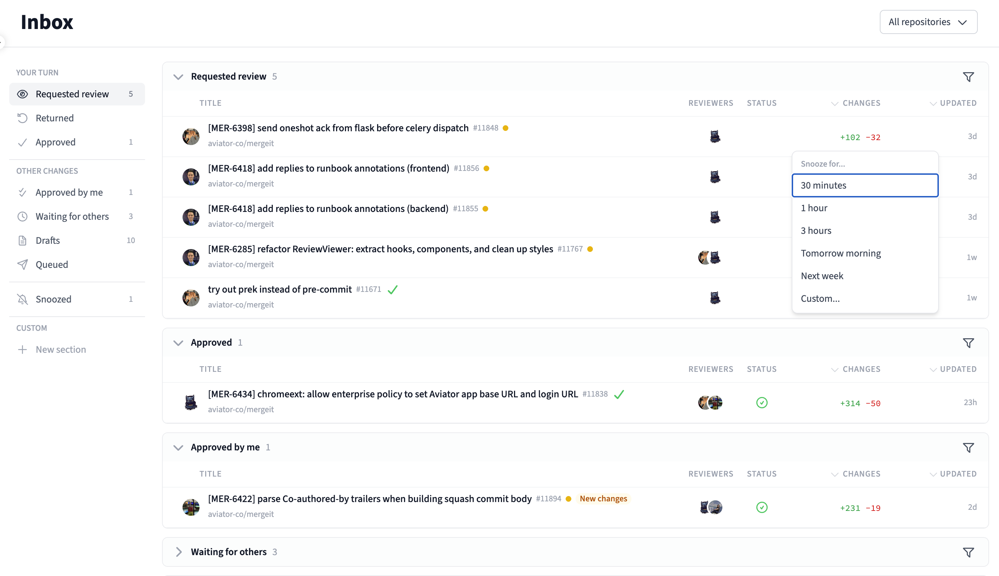
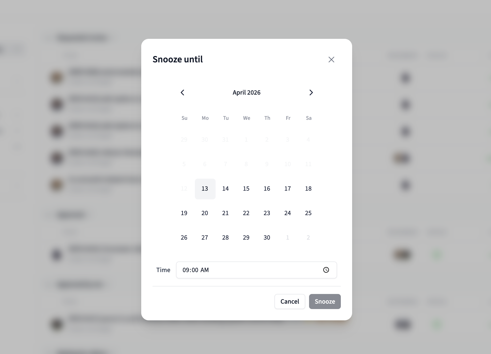
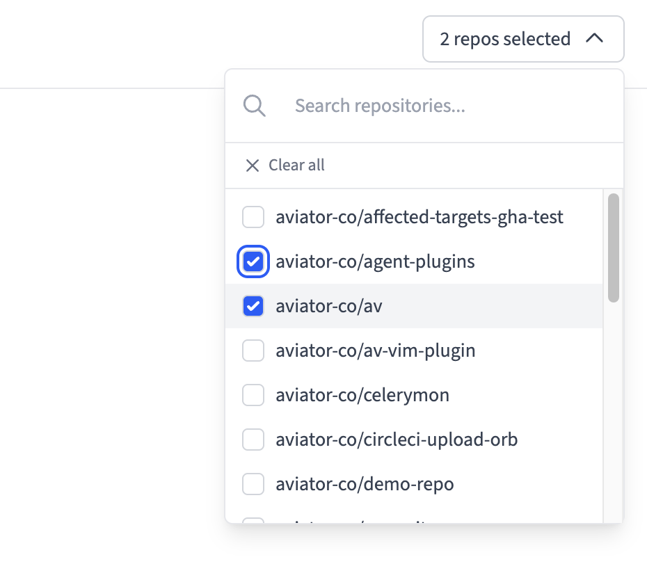
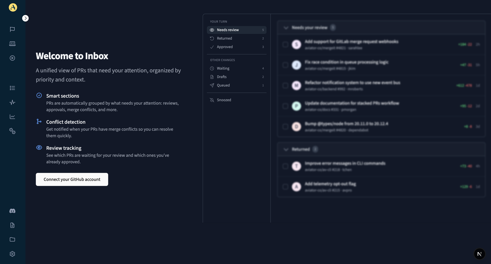

# Inbox

Inbox is your personalized dashboard for managing pull request reviews from GitHub. It organizes your PRs into meaningful sections so you can quickly identify what needs your attention and take action.


Inbox replaces the previous AttentionSet feature with a more powerful, organized experience.


<figure><figcaption>
Inbox dashboard
</figcaption></figure>

## Sections

Inbox organizes your pull requests into predefined sections based on your relationship to the PR and its current state:

### Requested review

PRs where you've been requested as a reviewer and need to take action. These are PRs authored by others that are waiting on your review.

### Returned

PRs you authored where the attention has come back to you — typically because a reviewer has commented, requested changes, or approved your PR.

### Approved

PRs you authored that have received all required approvals and are ready for the next step (e.g., merging or queuing).

### Approved by me

PRs where you've submitted an approval as a reviewer. These are no longer waiting on your action, but you can track their progress here.

### Waiting for others

PRs you authored that are waiting for action from reviewers. You don't need to do anything here — the ball is in someone else's court.

### Drafts

Draft PRs you've authored. These are work-in-progress changes that aren't yet ready for review.

### Queued

PRs you authored that are currently in the merge queue, waiting to be merged.

### Snoozed

PRs you've temporarily snoozed to remove them from your active sections. See [Snooze](#snooze) below.

## Section filters

Each predefined section has a filter icon that lets you apply exclusion filters to fine-tune what appears in that section. You can exclude specific authors, labels, or PRs with failing CI, and set a freshness threshold to hide stale PRs.

<figure><figcaption>
Section exclusion filters
</figcaption></figure>

## Attention

The core concept behind Inbox is **attention** — identifying who should be acting on a PR at any given moment. When the author sends a PR for review, reviewers have the attention. When reviewers respond, the author gets the attention back.

Every PR can have one or more people who have the attention. A merged PR will not have anyone's attention.

Attention is typically managed automatically based on GitHub events, but it can also be toggled [manually](manually-change-attention.md) as needed. See [Attention reasons](attention-reasons.md) for a full list of events that trigger attention changes.

## Real-time updates

Inbox updates automatically in real time as PR activity happens. When a reviewer comments, a CI check fails, or a PR is approved, your Inbox sections update immediately without needing to refresh the page.

## Snooze

Sometimes a PR doesn't need your immediate attention. The snooze feature lets you temporarily hide a PR from your active Inbox sections until a specified time.

Snoozed PRs are removed from all predefined sections and moved to a dedicated **Snoozed** view, accessible from the Inbox sidebar. When the snooze period expires, the PR automatically returns to the appropriate section.

To snooze a PR, click the snooze icon on any PR row in your Inbox. You can choose from preset durations (30 minutes, 1 hour, 3 hours, tomorrow morning, next week) or select **Custom** to pick a specific date and time.

<figure><figcaption>
Snooze duration options
</figcaption></figure>

When choosing a custom snooze duration, a calendar picker lets you select the exact date and time to unsnooze.

<figure><figcaption>
Custom snooze date and time picker
</figcaption></figure>

## Repository filtering

If you work across multiple repositories, you can filter your entire Inbox by repository using the dropdown in the top right. The repository filter applies across all sections, letting you focus on PRs from a specific project.

<figure><figcaption>
Repository filter
</figcaption></figure>

## Custom sections

In addition to the predefined sections, you can create your own custom sections with personalized filters. This is useful for tracking specific types of PRs — for example, PRs from a particular team, PRs with a specific label, or failing CI checks.

See [Custom sections](custom-sections.md) for details on creating and managing custom sections.

## Getting started

If you are a new Aviator user, you will first need to install the Aviator app on your GitHub repository. This is typically done as part of the initial setup wizard. You can choose to start with any of MergeQueue or FlexReview workflows to begin the setup.

<figure><figcaption>
Welcome to Inbox
</figcaption></figure>

Once the initial setup is complete, you will be prompted to link your GitHub account. This step is necessary so we can verify your GitHub username that is used to track your attention.

After linking your account, navigate to the **Inbox** page in the Aviator dashboard to see your pull requests organized by section.
