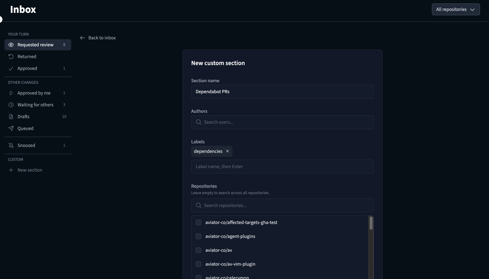

# Custom sections

Custom sections let you create personalized views of pull requests in your Inbox. Each custom section is defined by a set of filters and appears alongside the predefined sections in your Inbox sidebar.

## Creating a custom section

To create a custom section:

1. Click **New section** at the bottom of the Inbox sidebar.
2. Give your section a name (e.g., "Dependabot PRs" or "Frontend team").
3. Configure the filters for the section (see [Available filters](#available-filters) below).
4. Save the section.

<figure><figcaption>
Custom section editor
</figcaption></figure>

## Available filters

Custom sections support the following filters:

| Filter | Description |
|--------|-------------|
| **Authors** | Show only PRs authored by specific GitHub users. |
| **Labels** | Show only PRs with specific GitHub labels. |
| **Repositories** | Limit the section to PRs from specific repositories. Leave empty to search across all repositories. |
| **Draft status** | Filter by whether the PR is a draft or not. |
| **PR status** | Filter by pull request status (e.g., pending, queued). |
| **CI status** | Filter by CI status — passing or failing. |

You can combine multiple filters to create precise views. For example, you could create a section that shows all PRs with the "dependencies" label to track Dependabot updates across your repositories.

## Managing custom sections

### Editing

To edit a custom section, click the edit icon next to the section name in the sidebar. You can update the section name, filters, and badge count setting.

### Reordering

Custom sections can be reordered in the sidebar by dragging them to the desired position.

### Deleting

To delete a custom section, click the edit icon and then select **Delete**. This action cannot be undone.

## Badge counts

Each custom section can optionally show a badge count in the sidebar, displaying the number of PRs matching the section's filters. This is useful for at-a-glance visibility into sections that need attention.

To toggle the badge count, edit the section and check or uncheck the **Show badge count** option.

## Examples

Here are some useful custom section configurations:

- **Dependabot PRs**: Filter by the author "dependabot" to track automated dependency updates.
- **Urgent reviews**: Filter by a "urgent" or "priority" label to surface high-priority PRs.
- **Team PRs**: Filter by authors who are members of your team.
- **Failing CI**: Filter by CI status "failing" to quickly find PRs that need fixing.
- **Release PRs**: Filter by a "release" label to track release-related changes.
