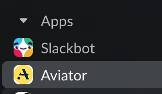

# Slack Integration for On-Premise

There are extra steps for the on-prem installations in order to use [<mark style="color:blue;">Slack Integration</mark>](../../api/personal-integrations.md).

## Create your Slack App

To use Aviator’s Slack notifications, your team will need to set up a Slack app. Follow the steps below.

### Set up app credentials

Navigate to `Basic Information`. Here you will find the information that allows your app to access the Slack API.

You’ll also need to add info for your GitHub app. Find it under `General` > `About` and `Client secrets` at the top of your app page.

Set the following environment variables:

```
SLACK_APP_ID = "..."
SLACK_CLIENT_ID = "..."
SLACK_CLIENT_SECRET = "..."
SLACK_SIGNING_SECRET = "..."

GITHUB_CLIENT_ID = "..."
GITHUB_CLIENT_SECRET = "..."
```

Feel free to set an app icon for Aviator in `Display Information`.

### OAuth and Permissions

#### Redirect URL

Set up a redirect URL: `https://<your_domain>/internal/api/slack/oauth/finish`

<figure><figcaption><p>Setup your OAuth redirect URL.</p></figcaption></figure>

#### Scopes

Select the following **Bot Token Scopes:** `chat:write`, `chat:write.public`, `commands`, `im:write`. Please make sure to set these correctly, they are required for the Slack OAuth flow.

<figure><figcaption><p>Add bot scopes.</p></figcaption></figure>

### Add slash commands

Create the following slash command, it will link a user’s Slack account with their Aviator activity on GitHub so individuals can receive DMs about their own PRs.

**Command**: `/aviator`

**Request URL**: `https://<your_domain>/slack/slash_command`

**Short Description**: `connect your Slack account`

**Usage Hint**: `connect`

<figure><figcaption><p>Add the slash commands.</p></figcaption></figure>

### Add in Slack Home Page

In your app config navigate to `Features -> Event Subscriptions`.

#### Enable Event Subscriptions

Set up a request URL: `https://<your_domain>/slack/events`

#### Subscribe to bot events

Select the following bot events to subscribe to: `app_home_opened`

<figure><figcaption><p>Enable bot events</p></figcaption></figure>

#### Enable Home Tab

In `Features -> App Home`enable the App Home's Home Tab.

<figure><figcaption><p>Enable the Home Tab</p></figcaption></figure>

## Connect the App

Follow the instructions here to connect the app to your account and get notifications: [<mark style="color:blue;">Slack Integration</mark>](../../mergequeue/how-to-guides/custom-integrations/slack-integration.md).
