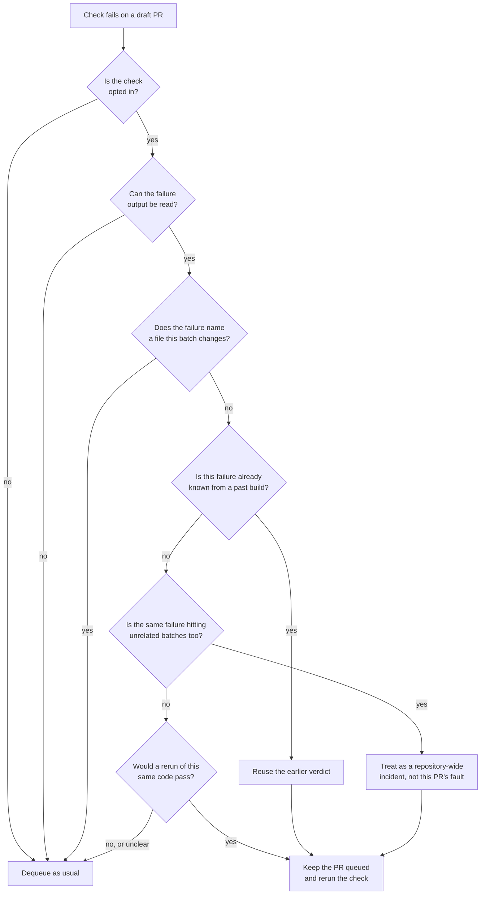

# Flaky test management \[Beta]

When a CI check fails on a draft PR, Aviator can investigate the failure before deciding what to do about it. If the failure looks like it would pass on a retry, Aviator reruns the check and keeps the pull request in the queue instead of dequeuing it and resetting everything behind it.

This page covers how Aviator identifies a flaky failure and the two things it does about it — rerunning the check and extending the queue's look-ahead depth. To set it up, see [How to configure flaky test management](../how-to-guides/configure-flaky-test-management.md).

For optimistic validation on its own, which waits on later batches without reading the failure, see [Optimistic validation](managing-flaky-tests-in-mergequeue.md).


Flaky test management is in beta. It is off by default and must be enabled per repository. See [How to configure flaky test management](../how-to-guides/configure-flaky-test-management.md).


## The problem

In [parallel mode](parallel-mode/), a failing draft PR dequeues its pull request and cascades into a queue reset. [Optimistic validation](managing-flaky-tests-in-mergequeue.md) softens this by waiting to see whether a later batch passes, but it treats every failure the same way: it has no idea *why* the check failed.

That is the gap this feature fills. A test that fails because a container image could not be pulled and a test that fails because the code is broken are both just "red" to the queue. Flaky test management reads the failure, tells them apart, and retries only the first kind.

## How Aviator decides

Every failure runs through the same ladder. Each step can answer on its own, and Aviator stops at the first one that does, so the expensive steps only run when the cheap ones are inconclusive.



### 1. Only checks you opt in

Aviator investigates the checks you list in `retriable_checks` and nothing else. A check you have not named is dequeued exactly as it is today. See [choosing which checks](../how-to-guides/configure-flaky-test-management.md#choosing-which-checks).

### 2. Reading the failure

Aviator fetches the failed job's output and extracts the part that describes the failure, skipping the setup and teardown noise that surrounds it. If the log cannot be fetched, or nothing in it identifies a failure, the investigation stops. **No log means no verdict** — Aviator will not guess.

### 3. Deterministic evidence first

If the failure output names a file the batch modifies, the failure is treated as related to the change and the PR is dequeued. This is a plain comparison of paths, it costs nothing, and it resolves a large share of real breakages without any model involved.

### 4. Failure identity and history

Aviator computes a stable identity for each failure from its structure — which test failed, what kind of error it was, and which of your own source frames it passed through — rather than from the raw text, so the same failure is recognised across runs even though timestamps, durations and process ids differ.

That identity does two things. A failure Aviator has already classified reuses that verdict instead of being investigated again. And when the same identity appears across batches that share no pull requests, the failure cannot be any one PR's fault — that is a repository-wide incident, and Aviator says so rather than blaming whichever PR happened to be at the front.

### 5. The model, last

Only when the deterministic steps are inconclusive does Aviator ask a model, and it asks exactly one question:

> Would this check pass if it were run again on the same code?

Not "did this change cause it". That distinction matters. A test broken on your main branch is not this pull request's fault, but it fails identically every time, so rerunning it only keeps a doomed batch alive. Aviator retries failures that are **transient**, not failures that merely belong to somebody else.

The model sees the failure output, the list of files the batch changes, and any [context you have written](../how-to-guides/configure-flaky-test-management.md#giving-aviator-context) about how this check tends to fail. It can also pull up the diff of any individual file when it needs to.

## How Aviator handles a flaky failure

Once a failure is judged transient, Aviator does two things, and they only work together. Rerunning a check takes minutes, so the queue has to be willing to wait for the answer; extending the wait is pointless if nothing is retried in the meantime.

### Rerunning the failed check

Aviator asks your CI provider to run the failed check again. It retries the **specific job that failed**, not the whole workflow, so work that already passed is not repeated.

On GitHub Actions, a matrix build is a job per leg. Retrying the run would repeat every leg; retrying the job repeats only the one that failed. Jobs that declare a `needs:` dependency on it are rerun with it, so a downstream job skipped by the failure still gets its chance.

Each failure is retried at most once. If the retry fails again, that is a failure — the pull request is dequeued as it would have been.

### Extending the look-ahead depth

Optimistic validation tolerates a limited number of failures before dequeuing, set by `optimistic_validation_failure_depth`. A failure judged transient **does not consume one of those**, so the queue keeps looking ahead instead of giving up while the retry runs.

Take a queue with `optimistic_validation_failure_depth: 2`:

```
Draft PR #3 (PR A)         →  e2e-checkout fails: preview environment timeout
                              judged transient, so it does not count
                              → the check is rerun, PR A stays queued
Draft PR #4 (PR A, PR B)   →  still running
```

Without this, that first failure spends one of the two allowed failures on a flake. With it, the budget is still intact for a real breakage, and the retry usually clears the check before it matters.

Your configured depth is a **floor**. A verdict can make the queue more patient, never less, so enabling this can never dequeue a pull request sooner than it does today.

## What Aviator will not do

The safety properties matter more than the feature itself, so they are worth stating plainly.

* **It never dequeues a PR sooner than it would today.** The configured failure depth is a floor. A verdict can only ever make the queue more patient.
* **It never retries a deterministic failure.** If the failure would fail the same way next time, it is dequeued, whether or not this change caused it.
* **Uncertainty changes nothing.** If the log cannot be read, the model is unavailable, or the answer is unclear, Aviator falls back to exactly the behaviour you have today.
* **It never marks a check as passing.** Aviator reruns the check and lets your CI decide. A rerun that fails again is a failure.

## Tracking flakiness over time

Whenever a check fails and then passes on the same commit, Aviator records that as an observed flake. The commit did not change, so the code cannot explain the disagreement.

These observations accumulate into a flake rate per check, which is available in your analytics and is fed back into the investigation as prior evidence: a check with a long history of flaking is treated differently from one that has never flaked before. The rate also appears in the [comment Aviator posts](../how-to-guides/configure-flaky-test-management.md#what-aviator-posts-on-the-pull-request) when it retries a check, and it is how you find your worst offenders and fix them, which remains the real solution.

## Supported CI providers

| Provider | Reading failures | Retrying |
| -------- | ---------------- | -------- |
| GitHub Actions | Supported | Reruns the failed job and its dependent jobs |
| Buildkite | Supported | Retries the failed step |

For GitHub Actions, Aviator reruns the individual failing job rather than the workflow run, so matrix legs that already passed are not repeated. Jobs that declare a `needs:` dependency on the failed job are rerun with it.

Checks that report as commit statuses rather than check runs can be investigated, but cannot be retried automatically — there is no per-job handle to retry. For those, Aviator can still extend the queue's patience.

## Configuring it

| To do this | See |
| ---------- | --- |
| Turn the feature on | [Minimal configuration](../how-to-guides/configure-flaky-test-management.md#minimal-configuration) |
| Decide which checks may be retried | [Choosing which checks](../how-to-guides/configure-flaky-test-management.md#choosing-which-checks) |
| Tell Aviator how a check tends to fail | [Giving Aviator context](../how-to-guides/configure-flaky-test-management.md#giving-aviator-context) |
| Keep that description in your repository | [Keeping context in a file](../how-to-guides/configure-flaky-test-management.md#keeping-context-in-a-file) |
| Adjust how long the queue waits | [Tuning alongside optimistic validation](../how-to-guides/configure-flaky-test-management.md#tuning-alongside-optimistic-validation) |

## Limitations

* A failure with no readable log cannot be investigated.
* A test that fails for a genuine but unrelated reason — broken on main, for example — is correctly not retried, and will still dequeue the PR.
* Retrying costs CI time. A check that flakes constantly is better fixed than retried, which is what the flake rate is there to tell you.
