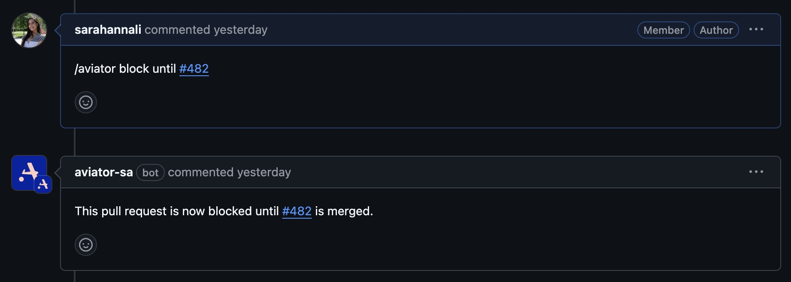
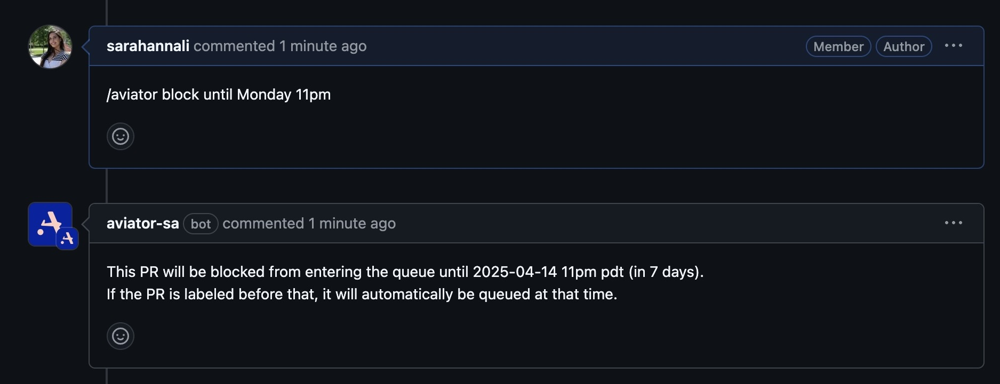

# How to Block Pull Request Mergeing with Slash Commands

Aviator supports conditionally blocking a pull request from being automatically merged in the queue using the `\aviator block until` command. When the pull request reaches the top of the queue, its specified "block until" condition is evaluated. If the condition is met, the PR is merged immediately. If not, the PR is marked as pending. Aviator then continuously checks pending PRs every minute and merges them as soon as their conditions are satisfied.

## Block Until PR

`\aviator block until <some other PR number>` will block a pull request from being merged until the reference PR has been merged.

<figure><figcaption></figcaption></figure>

## Block Until Timestamp

\aviator block until \<timestamp> will block a pull request from being merged until the given time has passed. Examples of valid timestamps include:

* Absolute ISO timestamp: `2025-02-15T12:30:00.000+0000`
* Date: `2025-02-15`
* Time: `9pm`
* Day of the Week: `Monday`
* Day + Time: `Monday 9pm`

<figure><figcaption></figcaption></figure>

## Cancel Block

`\aviator block cancel` will cancel all block conditions placed on the PR

