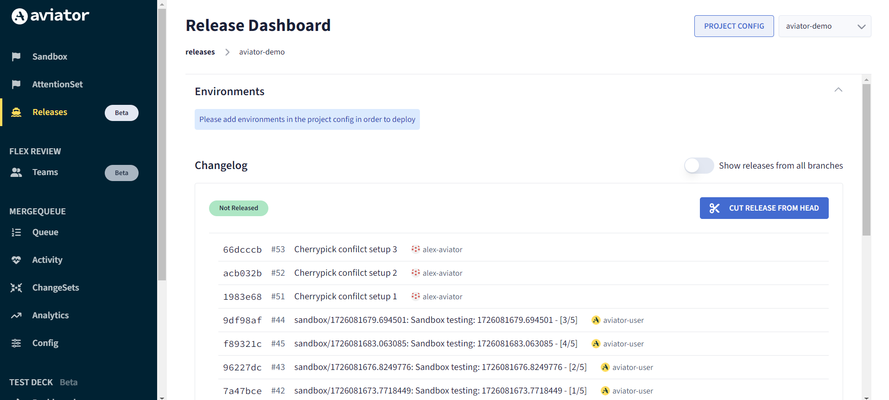
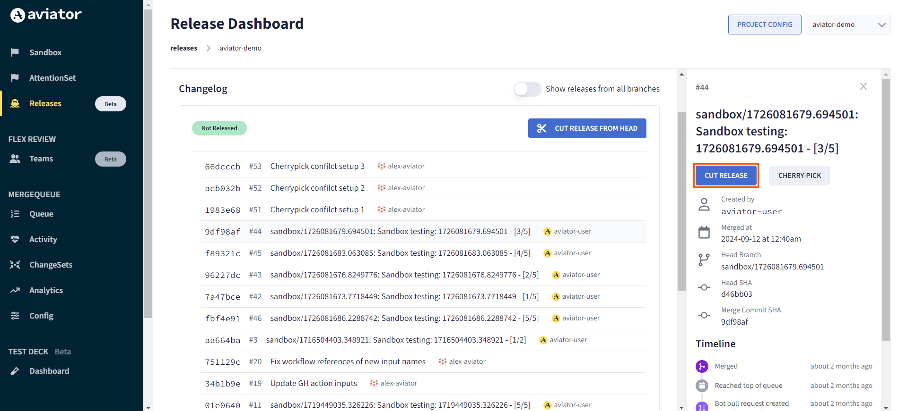
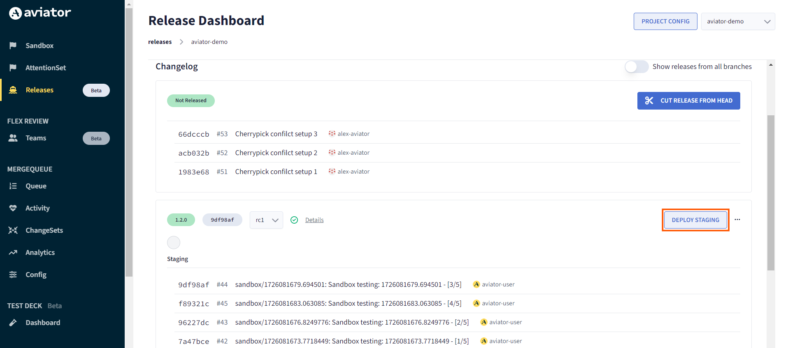
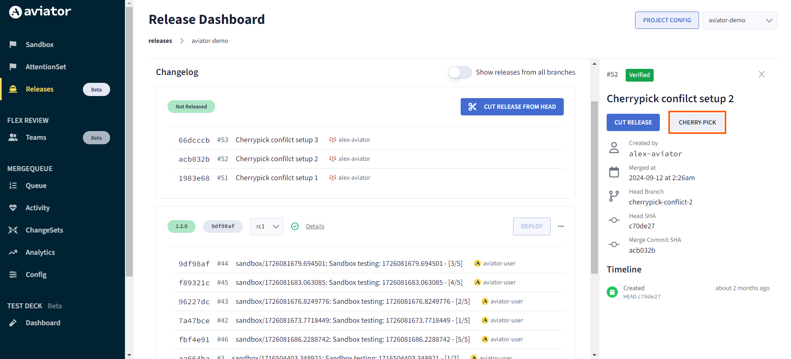
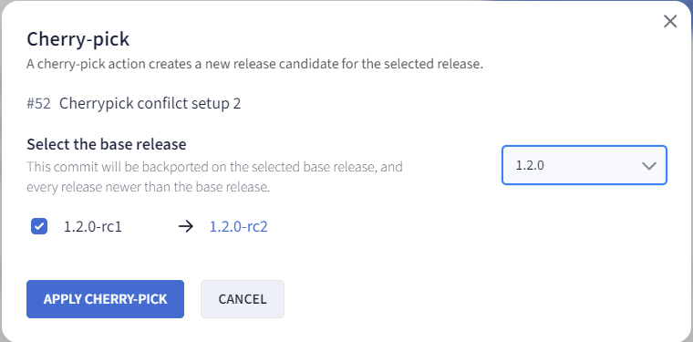
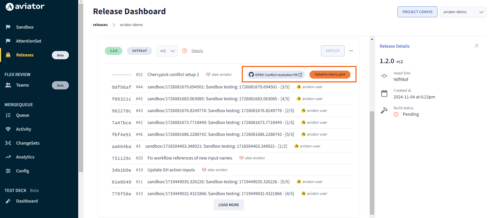
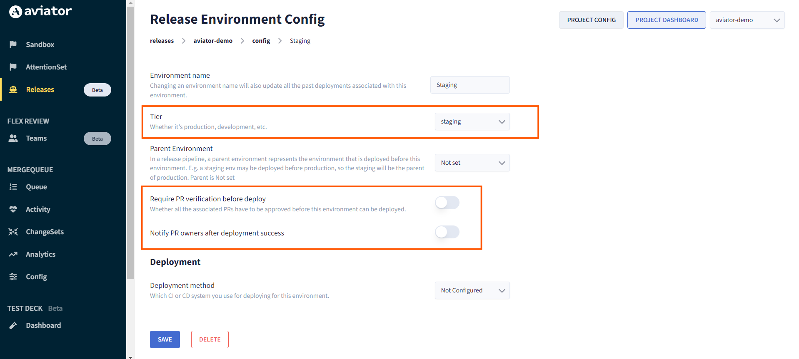
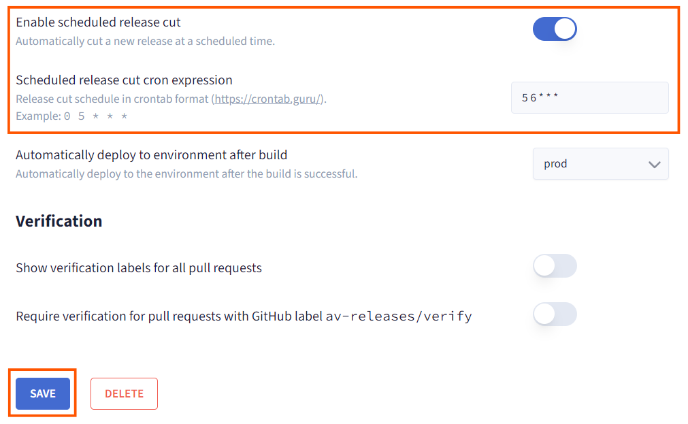

# Aviator Release Management Dashboard: Admin Guide

This guide provides a conceptual overview for Admins managing releases with Aviator’s Release Management Dashboard. It covers key dashboard features like monitoring pull requests, cutting releases, cherry-picking, and managing environments. Each of these concepts is designed to give Admins full visibility and control over the release lifecycle in Aviator, all from one central interface.

## Getting Started with the Release Dashboard

The Release Dashboard is your central hub for managing all release-related activities. From this interface, you can:

1. Monitor pull requests (PRs),
2. Cut new releases,
3. Cherry-pick PRs,
4. Configure environments.

Each feature is designed to streamline release management, making it easier to monitor, control, and adjust release workflows.

## Monitoring Pull Requests (PRs)

The dashboard allows you to view all merged PRs, providing insight into changes that have been approved and are ready for the next release cycle. By monitoring PRs, Admins can keep track of feature updates, bug fixes, and other code changes integrated into the release process.

This visibility helps ensure that Admins are aware of the components in each release, which is essential for effective release planning and communication with stakeholders.

## Cutting a Release

“Cutting a Release” refers to creating a new release version with a specific set of changes from the PRs. Here’s how to do it:

1. Select PRs to Include: Choose which PRs will be part of the release.

2. Define Release Version: Add a version number (e.g., v1.2.0).

3. Once the release is cut, Aviator prepares it for the deployment process based on the environments and workflows you’ve configured.

## Cherry-Picking Specific PRs
Aviator’s cherry-pick feature allows Admins to selectively add specific PRs to an existing release, ideal for hotfixes or urgent updates.

### Steps to Cherry-Pick:

1. Choose PR to Cherry-Pick: Identify the PR you want to add and initiate the cherry-pick.

2. Select Release Version: Choose the target release version for the cherry-pick.

3. Resolve Conflicts if Necessary: Aviator flags merge conflicts directly in the dashboard, guiding you through the steps to resolve conflicts in GitHub.

Cherry-picking is an efficient way to handle last-minute changes without merging the entire branch into the release.

## Managing Environments
Environments in Aviator represent the deployment targets (e.g., production, staging, or testing) where releases will be deployed. For each environment, you can set up configurations to control deployment workflows and notification rules, allowing for structured, environment-specific release management.

You can:

1. Define Environment Tiers: Set up environments with specific purposes, like production or testing.
2. Configure Pre-Deployment Verifications: Enable PR verification and testing in staging environments before a release reaches production.
3. Set Up Notifications: Establish environment-specific notifications to keep stakeholders informed as changes are deployed to each environment.

This setup helps ensure a smooth transition through the deployment pipeline, with clear oversight and quality control across each stage. To learn more about it refer the [configuring environments](./configuring-environments.md) guide.

## Scheduled Releases
Scheduled Releases allow Admins to automate deployments based on a predefined timeline. This feature is useful for periodic updates or planned releases that align with organizational timelines. You can set up release schedules using Unix-style cron expressions to control exact release timings.

Learn more about scheduling the releases [here.](./create-a-scheduled-release.md)
