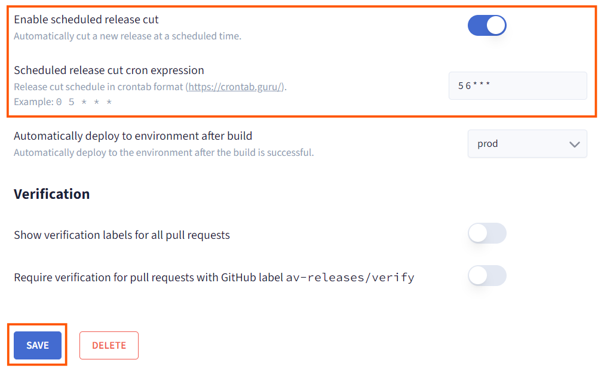

# Aviator Release Management Dashboard: Developer Guide
This guide provides a walkthrough for developers using Aviator’s Release Management Dashboard. It covers essential actions like viewing pull requests (PRs), creating releases, cherry-picking, selecting deployment environments, and scheduling releases. By understanding these dashboard features, developers can take an active role in the release management process.

## Understanding the Release Project Setup
Before developers begin interacting with the Release Dashboard, admins [configure a Release Project](./creating-a-release-project.md). This setup organizes a collection of services or applications into a single release project, defining key parameters like Git repository connections, Git tag patterns, and CI/CD integration preferences (e.g., GitHub Actions, Buildkite). This configuration lays the foundation for managing PRs, builds, and deployments within Aviator.

## Monitoring Pull Requests (PRs)
Once developers raise PRs, they are immediately visible on the Aviator Release Dashboard. The dashboard displays details for each PR, including commit messages, author, and timestamps, allowing developers to monitor the status of all contributions.

Developers can:

1. Track Merged PRs: See which changes are integrated and ready for release.

2. View PR Details: Drill down into specific PRs to review code, comments, and merge status.

3. This real-time view keeps developers updated on the status of their contributions and helps coordinate efforts for upcoming releases.

## Cutting a Release
Developers can create new release versions directly from the dashboard by selecting a set of PRs to include. Cutting a release packages approved PRs into a specific version, which will then be prepared for deployment to the designated environments.

### Steps for Cutting a Release:
1. Select PRs: Choose the PRs that should be part of the new release. This selection helps ensure the right set of features and fixes are deployed together.

    

2. Define Release Version: Add a version identifier (e.g., v1.2.0) for easy tracking and communication.

    

3. Initiate the Release: Once the release is cut, Aviator prepares it for the next steps based on the predefined environment configurations and workflows.

    

By cutting releases, developers can incrementally deploy changes in a structured manner, providing more control over the release cycle.

## Cherry-Picking Specific PRs
The cherry-pick feature in Aviator enables developers to selectively include specific PRs in a release without merging the entire branch. Cherry-picking is particularly useful for urgent updates or hotfixes that need to be deployed outside of the regular release cycle.

### Cherry-Picking Steps:
1. Identify and Select a PR: Choose the PR that needs to be cherry-picked for inclusion in the release.

    

2. Target Release Version: Specify the version where the cherry-pick should be applied, ensuring the change integrates with the right release.

    

3. Resolve Conflicts: Aviator flags any merge conflicts, directing developers to GitHub or other tools for conflict resolution.

    

Cherry-picking allows developers to be agile with changes that need to be fast-tracked, without disrupting the broader release plan.

## Selecting Environments for Deployment
In Aviator, environments represent deployment targets (e.g., staging, production, or QA). Each environment is set up with its own configurations, including pre-deployment checks and notification rules, enabling developers to deploy releases to different stages in a controlled manner.

Developers can:

1. Choose Deployment Environment: Select the environment (e.g., staging or production) for the release.

2. Run Pre-Deployment Checks: If configured, pre-deployment verifications will be performed to ensure stability.

3. Deploy to Environment: Trigger deployment, moving the release through the structured pipeline toward production.

    

Understanding environment configurations ensures that developers deploy releases responsibly and align with the testing and staging requirements before reaching production. To learn more about it refer the [configuring environments](./configuring-environments.md) guide.

## Scheduling Releases for Deployment
Scheduled releases in Aviator allow developers to deploy changes automatically at specified times. This feature is valuable for coordinating releases to align with business needs, minimize downtime, or optimize deployment times.

### Steps to Schedule a Release:
1. Enable Scheduled Release: Turn on scheduled release for the project if not already enabled.

2. Set Up Cron Schedule: Use a Unix-style cron expression to set the exact date and time for the release.

3. Scheduled releases allow developers to coordinate releases more effectively, especially for routine updates or releases that must occur during low-traffic times.

    

Learn more about scheduling the releases [here.](./create-a-scheduled-release.md)