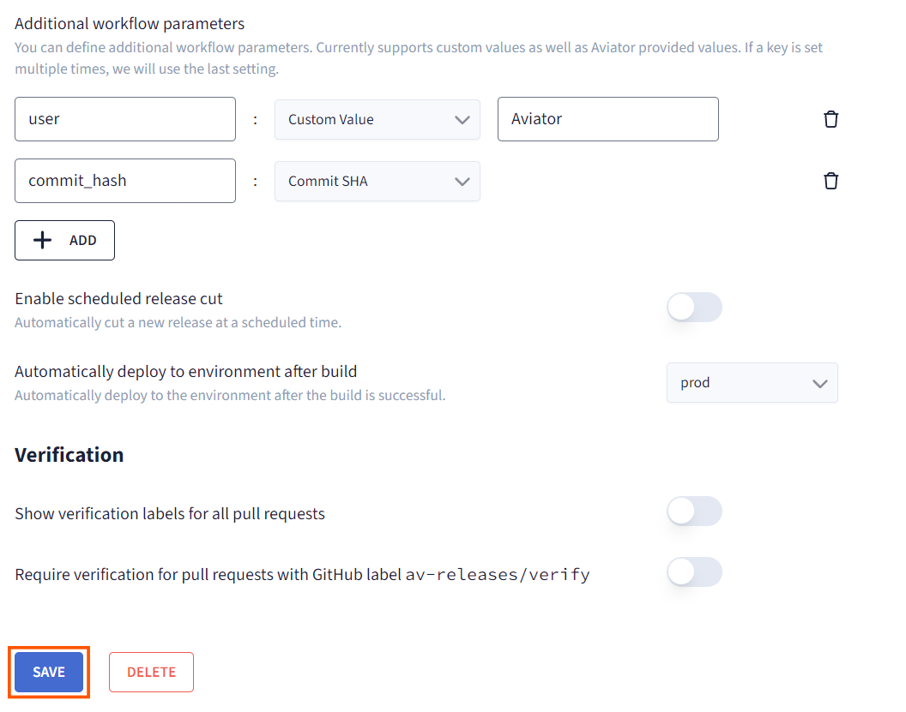
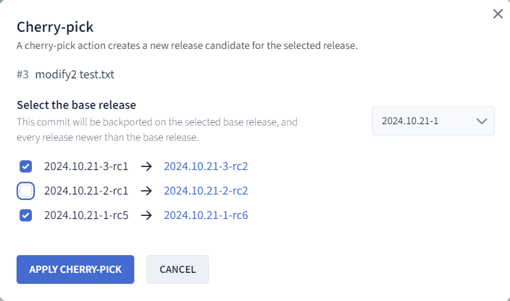
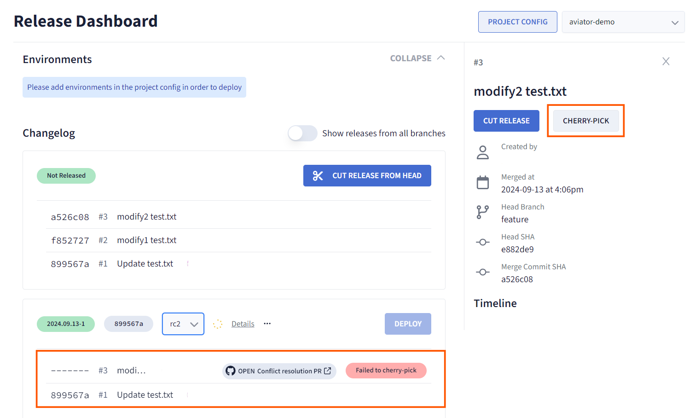

# Aviator Release Management: A Complete Walkthrough
## Introduction
This guide provides a step-by-step walkthrough of Aviator’s release management process, covering all the key features you need to manage releases efficiently. From setting up release projects to automating workflows, scheduling releases, and managing environments, this guide will help you master release management in Aviator. Each feature is linked to its respective detailed guide for further exploration.

## 1. Creating a Release Project
To begin managing releases in Aviator, the first step is creating a Release Project, where all services that need to be built and deployed together are grouped. Start by defining a name for the project, linking it to your GitHub repository, and setting up Git tag patterns to help track versions and updates.

<figure><figcaption></figcaption></figure>

Once your project is established, you'll configure the build setup based on your workflow. Whether you're using GitHub Actions, Buildkite, or another CI tool, this setup is key for building and deploying your code consistently. For a more details, refer to the [guide to create a release project](./creating-a-release-project.md).

## 2. Configuring Environments
With your Release Project ready, it's time to set up the environments where the code will be deployed, such as production, staging, or development. Each environment in Aviator is tied to a specific release project and can be configured with unique characteristics like names, tiers, and pre-deployment verifications. For example, you might want a staging environment to verify PRs before they go live in production.

<figure><figcaption></figcaption></figure>

You can also set up notifications to alert PR authors once their changes are successfully deployed. This helps keep your team informed and proactive with updates. To learn more, see the [Configuring Environments guide](./configuring-environments.md).

## 3. Working with Your CI/CD
Automation is essential for reliable and efficient deployments. Aviator supports CI/CD tools such as GitHub Actions and Buildkite, which streamline your build and deployment processes.

### For GitHub Actions:

1. Set up an Aviator API token and add it to your GitHub repository secrets.
2. Define workflows for the build and deployment steps, choosing whether to split them into separate steps or keep them in a single workflow based on your needs.
3. Sync the workflow run IDs with Aviator to track deployments accurately.

```yaml
on:
  workflow_dispatch:
    inputs:
      aviator_release_cut_id:
        description: "Database ID of release cut"
        required: false
        type: string
      aviator_release_cut_commit_hash:
        description: "Commit SHA, branch name, or tag of the HEAD to be built"
        required: false
        type: string
      aviator_release_candidate_version:
        description: "Name of the version"
        required: true
        type: string

    steps:
      - if: inputs.aviator_release_cut_id != ''
        name: Sync workflow run ID via Aviator API
        uses: fjogeleit/http-request-action@v1
        with:
          url: 'https://api.aviator.co/api/v1/sync-build-github-action'
          method: 'POST'
          bearerToken: ${{ secrets.AVIATOR_API_TOKEN }}
          data: '{"release_cut_id": "${{ inputs.aviator_release_cut_id }}", "workflow_run_id": "${{ github.run_id }}"}'

      - name: Checkout the repository
        uses: actions/checkout@v4
        with:
          # if custom commit_sha is not defined, this should fall back to the head branch
          ref: "${{ inputs.aviator_release_cut_commit_hash }}"
          lfs: true
          submodules: 'recursive'
```

### For Buildkite:

1. Configure your API access tokens and webhook integration with Aviator.
2. Align your build and deploy workflows by setting environment variables and ensuring that pipeline configurations match Aviator’s specifications.

<figure><figcaption></figcaption></figure>

Each CI/CD integration provides specific details and options. For further setup instructions, consult the CI/CD integration guides for [GitHub Actions](./working-with-your-ci-cd/github-actions-workflow.md) or [Buildkite](./working-with-your-ci-cd/buildkite-workflow.md).

## 4. Scheduling a Release
Once your CI/CD integration is in place, you can automate releases with Aviator’s scheduling feature. Scheduled releases allow you to define precise timings, so updates are rolled out in accordance with your organization’s timeline and release cadence.

1. Enable scheduled releases in your project settings.
2. Use a cron expression (a Unix-based timing format) to specify the exact times for your releases.


This automation is especially useful for teams with frequent, periodic releases or those operating in a DevOps culture. Check out the [Scheduled Release guide](./create-a-scheduled-release.md) for a deeper dive.

## 5. Creating Custom Workflow Parameters
To further tailor your workflows, Aviator supports custom workflow parameters, allowing you to define key-value pairs specific to each build and deployment. For instance, you might have different environment variables for production and staging, or unique parameters for test environments.

1. Add parameters in the build and deployment workflows to configure them per environment.
2. Ensure that your CI/CD pipelines are set to recognize these parameters as inputs, so they can dynamically adjust the release process as needed.



This flexibility can be a game-changer for organizations with multiple environments. See the [Custom Workflow Parameters guide](./create-custom-workflow-parameters.md) for more.

## 6. Managing Cherry-Picks
Sometimes, you’ll want to include specific changes in a release without merging an entire branch. Aviator makes this easy with its cherry-pick feature, which lets you selectively add PRs to a release candidate.

1. From the release dashboard, select the PR to cherry-pick.
2. Choose the target versions you want the cherry-picked change to apply to.



This is helpful for hotfixes or small changes that need immediate deployment. Explore the [Cherry-Picking guide](./managing-cherry-picks.md) to get a deeper understanding of this process.

## 7. Resolving Cherry-Pick Failures
In cases where cherry-picking encounters merge conflicts, Aviator provides tools to help resolve them. Aviator flags conflicts directly in the release dashboard, offering a quick way to jump into the resolution process.

1. Detect conflicts and use the Aviator link to navigate to GitHub’s conflict resolution tools.
2. After resolving, finalize the release candidate by accepting the solution in Aviator.



For more detailed guidance, refer to the [Cherry-Pick Failure guide](./resolving-a-cherry-pick-failure.md).

## Conclusion
By following this walkthrough, you now have the essential steps and tips to manage releases with Aviator effectively. From creating release projects to setting up CI/CD integrations, automating releases, and managing cherry-picks, Aviator provides a comprehensive suite of tools for smooth and reliable release management.
