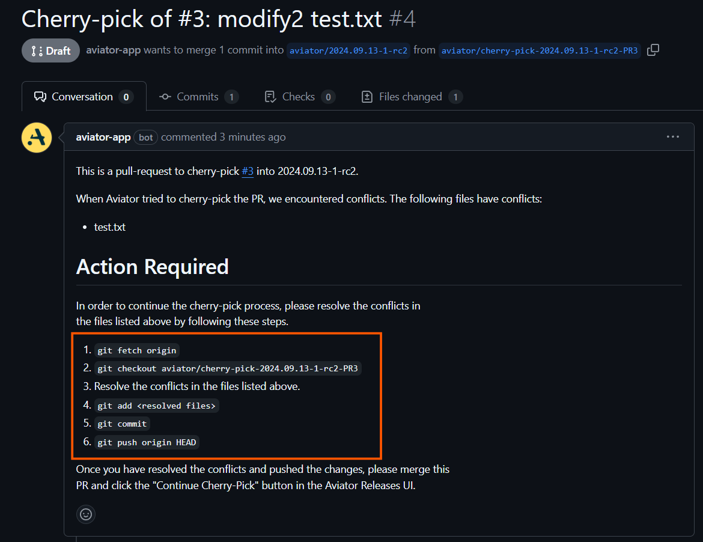
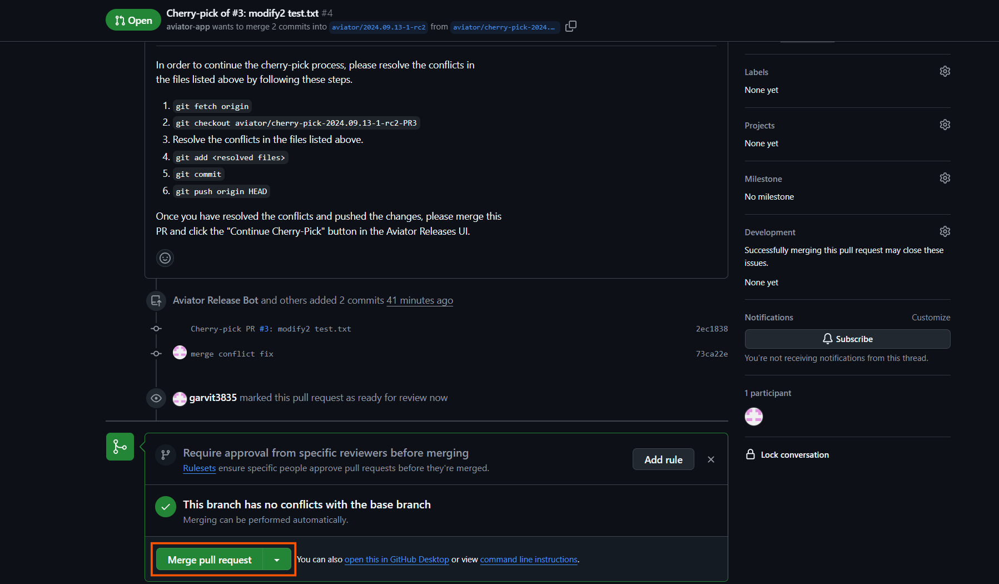
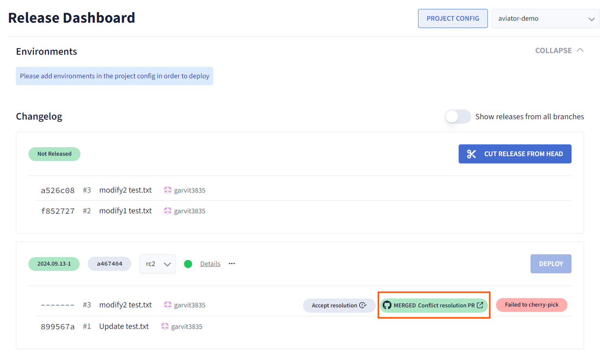

# Resolving a Cherry-Pick Failure

Cherry-picking is a common workflow in version control that allows you to selectively integrate specific changes (commits) from one branch into another. However, sometimes a cherry-pick can fail due to a merge conflict. This document will guide you through managing such a scenario during a release process in Aviator.

Setup a repository, connect it to Aviator and [create a release project](./creating-a-release-project.md) for this guide.

## Create a Base Release

1. Add a new file to your repository. For example, `echo "base" > test.txt`

2. Commit and push the changes to a different branch.

3. Create a pull request to the main branch.

4. Merge the PR into the main branch.

5. Cut a release: Create a new release based on this PR.

## Raise Two more Pull Requests

1. First PR: `Ensure test.txt` contains "base".

2. Modify the file: `echo "modify1" > conflict-test.txt`.

3. Commit and merge the PR.

4. Second PR: Confirm that conflict-test.txt shows modify1.

5. Modify the file again: `echo "modify2" > conflict-test.txt`.

6. Commit and merge the PR.

### Merge Conflict

To create a merge conflict for this tutorial, go to the Aviator Release Dashboard, select the last PR (the one with modify2), and follow these steps:

1. Select the PR: Click on the PR you want to cherry-pick(last PR in this case).

2. Cherry-Pick: Click the "Cherry-Pick" button to integrate the changes into the base release.

You will see a red tag indicating "Failed to cherry-pick" due to a merge conflict. If you encounter this issue, follow the steps below to resolve it.

## Resolve Merge Conflicts

1. On this failed cherry-pick commit, you should see the conflict resolution PR link. Open the link and follow the instructions to resolve the conflict.

2. Follow the steps provided by the Aviator-app bot to fetch the code in your dev environment and resolve the conflict. Alternatively, you can use GitHub UI to resolve the conflicts. The conflicting files will be flagged with diffs showing the necessary resolutions. You can click on each conflict and choose which changes to keep or edit the file directly in the GitHub UI. Ensure you select the changes from the second PR as the final result.

3. After pushing the changes, you should be able to merge the PR. You may optionally also get this reviewed by a coworker for correctness.

4. Once PR is merged successfully, go back to the UI and click "Accept Resolution". This step is crucial for the resolution to be recognized and accepted as a new Release Candidate (RC).

5. After accepting the resolution, the Release Candidate (RC) should now reflect the correct version of the file following the conflict resolution.

