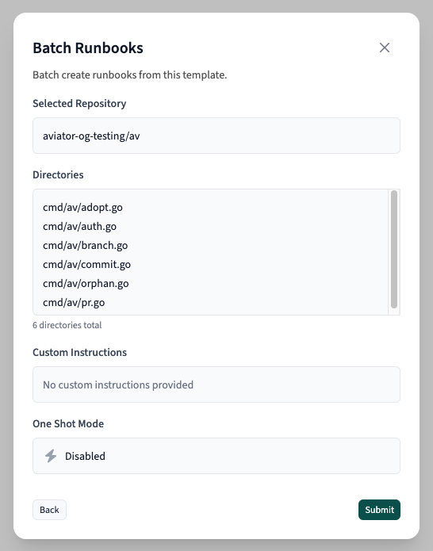
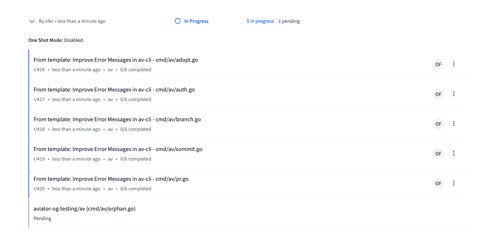
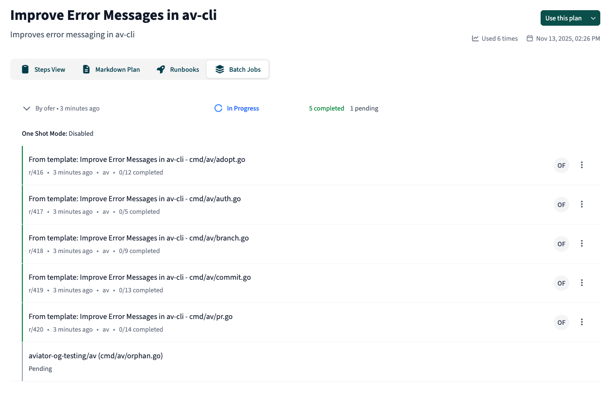

# Batch Operations with Runbook Templates

Batch operations allow you to apply a single Runbook template across multiple targets simultaneously, saving time when you need to perform the same changes across many repositories or directories. Instead of manually creating individual Runbooks one at a time, you can create dozens or even hundreds in a single operation.

### Overview

Runbook templates support two types of batch operations:

1. **Multi-Repository Batches**: Apply a template to multiple repositories, creating one Runbook per repository
2. **Multi-Directory Batches**: Apply a template to multiple directories within a single repository, creating one Runbook per directory

Each batch operation can target up to 200 repositories or directories. When you create a batch, the system creates individual “fanouts” for each target, which are processed concurrently with automatic retry and timeout handling.

### Use Cases

Batch operations are particularly useful for:

* **Dependency upgrades**: Update a library version across all microservices in your organization
* **Code migrations**: Apply framework migrations or API changes to multiple services
* **Security patches**: Roll out security fixes across your entire repository portfolio
* **Style consistency**: Enforce code style or linting rule changes across a monorepo’s directories
* **Configuration updates**: Update configuration files or environment settings across multiple projects

### Creating a Batch Operation

#### Step 1: Navigate to Your Template

Batch operations can only be created for Templates. If you don’t have an existing template, you can [publish](https://docs.aviator.co/runbooks/getting-started#id-6.-publishing-a-template) any Runbook to a Template from the chat session.

From the Runbooks templates page, select the template you want to apply in batch mode. Click on the template to view its details.

#### Step 2: Open the Batch Modal

On the template detail page, click the dropdown arrow next to the “Use this plan” button and select **“Create Runbook Batch”**.

 (4).png>)

#### Step 3: Choose Your Batch Type

The batch creation modal presents two tabs:

#### Per Repository

Use this option to apply the template to multiple repositories. Each repository will get its own Runbook instance.

**How to select repositories:**

* Use the repository multi-select dropdown to choose target repositories
* You can search and select multiple repositories from your organization
* Selected repositories appear as chips that can be individually removed

**Example use case:** Upgrading React from v17 to v18 across all frontend repositories in your organization.

#### Per Directory

Use this option to apply the template to multiple directories within a single repository. Each directory will get its own Runbook instance.

**How to specify directories:**

1. Select a single repository from the dropdown
2. Enter directory paths in the text area, one per line
3. Alternatively, upload a CSV or TXT file containing directory paths
4. The system automatically deduplicates directory paths

**Example use case:** Migrating all service modules in a monorepo from CommonJS to ES modules, targeting `services/auth`, `services/payments`, `services/notifications`, etc.

 (2).png>)

#### Step 4: Add Customization Instructions (Optional)

Customization instructions allow you to tailor the template execution for your specific use case. These instructions are applied to all Runbooks in the batch and help Claude Code understand context-specific requirements.

**Example customization instructions:**

1.  For a dependency upgrade:

    ```
    We're upgrading from Lodash v4.17.15 to v4.17.21. Pay special attention to
    the deprecated methods in our codebase. We use lodash/fp extensively in our
    data transformation pipelines.
    ```
2.  For a code migration:

    ```
    This is a Next.js Pages Router to App Router migration. Preserve all existing
    SEO metadata and ensure dynamic routes continue to work. We use ISR
    (Incremental Static Regeneration) heavily, so convert those patterns to the
    new revalidate approach.
    ```

The more specific your instructions, the better Claude Code can adapt the template to your needs.

#### Step 5: Configure One Shot Mode (Optional)

Enable the “One Shot Mode” toggle if you want all generated Runbooks to execute immediately after creation. When disabled the Runbooks are created and available to review before execution.

For more information about One Shot Mode, see the [One Shot Mode documentation](https://docs.aviator.co/runbooks/how-to-guides/one-shot-mode).

#### Step 6: Review and Submit

Click **“Review”** to see a summary of your batch configuration:

* Selected repositories or directories
* Custom instructions (if provided)
* One Shot Mode setting

Verify everything is correct, then click **“Submit”** to create the batch.



### Monitoring Batch Progress

After submitting, you’ll be redirected to the template’s **“Batch Jobs”** tab where you can monitor progress.



#### Understanding Batch Status

Each batch displays:

* **Triggered by and timestamp**: Who created the batch and when
* **Overall status**:
  * **In Progress**: At least one fanout is still processing
  * **Completed**: All fanouts have completed successfully
  * **Failed**: All fanouts have reached a terminal state with at least one failure
* **Fanout counts**: Breakdown of how many fanouts are completed, in progress, pending, or failed

#### Viewing Individual Fanouts

Click on a batch row to expand it and see detailed information:

**Batch Configuration:**

* One Shot Mode status
* Custom instructions (if any were provided)

**Fanout List:** Each fanout represents one repository or directory and shows:

* Target repository, and directory if applicable
* Status indicator with color coding:
* 🟢 **Green**: Completed successfully
* 🔵 **Blue**: In progress
* ⚪ **Gray**: Pending (waiting to start)
* 🔴 **Red**: Failed
* Link to the created Runbook



#### Interacting with Generated Runbooks

Once a fanout completes successfully, you can:

* Click on the runbook to view its progress and results
* Share the runbook with team members using the share button
* Review the changes and pull requests created by the runbook

### Technical Details

#### Concurrency and Processing

Batch operations process multiple fanouts concurrently to optimize execution time. The system:

* Processes fanouts in parallel according to configured concurrency limits, default **5** simultaneous fanouts
* Automatically retries stalled operations
* Times out fanouts that exceed configured duration limits

#### Batch Size Limits

* Maximum of **200 targets** per batch (repositories or directories)
* This limit ensures reliable processing and reasonable execution times

#### Monitoring and Reliability

The platform includes automated monitoring that:

* Detects and restarts stalled batches every 30 minutes
* Cancels hanging fanouts that exceed timeout thresholds
* Provides real-time status updates in the UI

### Best Practices

1. **Start small**: Test your template on a few repositories first before creating a large batch
2. **Use descriptive customization instructions**: Provide context about your codebase’s specific patterns and requirements
3. **Monitor progress actively**: Keep an eye on the Batch Jobs tab during execution, especially for large batches
4. **Check for failures**: If fanouts fail, review the error messages and adjust your template or customization instructions accordingly

### Troubleshooting

#### Batch is stuck in “In Progress”

The monitoring system checks for stalled batches every 30 minutes and automatically restarts them. If a batch appears stuck for longer, it may indicate an issue with your account credits or configuration.

#### Multiple fanouts are failing

Review the error messages on failed fanouts. Common issues include:

* Insufficient Runbook credits
* Repository access permissions
* Invalid directory paths
* Template incompatibility with target codebase structure

#### Want to cancel a batch

Individual fanouts can be cancelled by cancelling their associated Runbooks. The batch will update its status as fanouts complete or are cancelled.

### See also

* [templates.md](../concepts/templates.md "mention")
* [managing-templates.md](managing-templates.md "mention")
* [one-shot-mode.md](one-shot-mode.md "mention")
