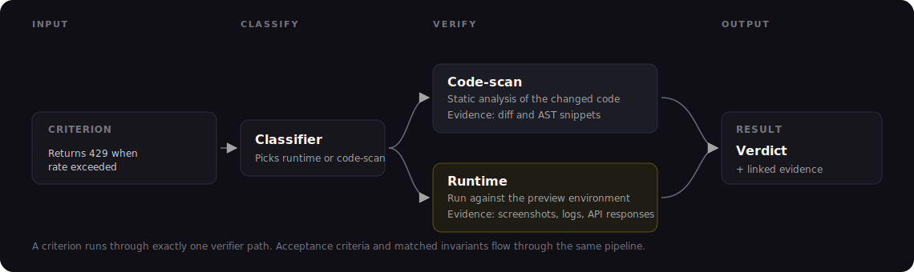

# How verification works

This document goes deeper than the [How it works](../how-it-works.md) narrative. It covers what actually happens inside a verification run — how criteria are classified, how each verifier produces evidence, and why the same code always yields the same verdict.

### A verification run, end to end

A run starts when the agent submits a runbook through the MCP and acceptance criteria are generated (or read from the supplied spec). Aviator does three things in order:

1. **Constructs the run.** Pulls the change set (the diff against the target branch), the acceptance criteria, and the invariants whose conditions match the change. Allocates a preview if any criterion will need one.
2. **Routes each check through the pipeline.** Every criterion runs through one of two verifier paths. Verdicts are produced in parallel where possible.
3. **Compiles the results.** Verdicts, evidence, and links to the preview are assembled into the review document.

The run is observable in real time — the review document streams updates as verdicts land.

### The criterion pipeline

<figure><figcaption>
One criterion → one verifier path → one verdict with evidence
</figcaption></figure>

Each criterion goes through exactly one verifier. A classifier picks the path based on the criterion text and the files the change touched.

| Verifier      | Picked when…                                                                                | Produces                                                              |
| ------------- | ------------------------------------------------------------------------------------------- | --------------------------------------------------------------------- |
| **Code-scan** | The criterion is a structural assertion — file scope, dependency surface, function signature, type. | The diff or AST snippets that demonstrate the claim.                  |
| **Runtime**   | The criterion is behavioral — endpoint contract, error shape, side effect, UI behavior.    | Screenshots, console logs, DOM snapshots, API responses, full trace.  |

If you read a verdict and disagree with the path the classifier picked, that's a signal — usually the criterion was written ambiguously enough to land in the wrong path. Tightening the criterion text usually moves it back.

### How runtime verification actually runs

Runtime verdicts are the most expensive. They need:

1. A **preview** to run against (see [Concepts: Previews](previews.md)).
2. A **skill set** that tells the agent how to operate the preview — base URL, test users, fixtures (see [Writing a SKILL.md](../how-to-guides/writing-a-skill-md.md)).
3. The **criterion text** — the specific claim being verified.

The runtime runner is an agent that drives the preview through a small program tailored to the criterion: set up preconditions, exercise the endpoint or click through the flow, capture evidence, compare to the expected shape. It records what it did and what came back.

Evidence shapes for runtime verdicts:

| Evidence type | When                                                       |
| ------------- | ---------------------------------------------------------- |
| Screenshot    | UI scenarios, visual assertions.                           |
| DOM snapshot  | UI state assertions, "the modal closed after X."           |
| Console log   | Client-side error/behavior assertions.                     |
| API response  | Backend assertions — status, headers, body shape, timing.  |
| Trace         | Full agent transcript of the run, captured for every scenario. |

This is the part most teams underinvest in early — a thin SKILL.md and stale seed data produce runtime verdicts you can't trust. The pipeline runs fast, but the verdict is only as good as the preview it ran against.

### How invariants compose with criteria

Invariants are your team's standing rules. When the runbook is created, the invariant selector picks which active invariants apply to this change based on the spec, the plan, and the scope — and materializes each pick as an acceptance criterion (tagged with `source: baseline_invariant`).

The composition rule: a run passes only if every criterion — user-authored or invariant-materialized — passes. Failures stack: one failed user criterion plus two failed invariants produces three verdicts on the same review document, not one merged failure.

See [Verification layers](verification-layers.md) for how invariants and user criteria interact, and [Invariants](invariants.md) for where invariants come from and how the selector works.

### Determinism

Code-scan verdicts are deterministic. Run the same change against the same criterion twice — same verdict, same evidence.

Runtime verdicts depend on an agent driving the preview, which uses an LLM. They're stable for the same input but not strictly reproducible across re-runs. The system mitigates this by caching evidence per criterion + change set so re-runs of the same content don't re-execute.

Why determinism matters where you can get it:

* You can reproduce failures.
* Re-runs after no code changes don't flip results.
* Audit records hold up across time.

### Performance

A typical run completes in 30–120 seconds:

| Factor                  | Effect                                                                                   |
| ----------------------- | ---------------------------------------------------------------------------------------- |
| Diff size               | Larger diffs → more code-scan + invariant matches. Sub-linear.                          |
| Number of criteria      | One verifier per criterion. Linear; parallelized where possible.                         |
| Runtime criteria        | Each runtime criterion drives the preview. Dominates total time once present.           |
| Preview cold-start      | Most of the variance. Bake heavy work into the image — see [Managing previews](../how-to-guides/managing-previews.md). |
| Matching invariant count| Linear; usually cheap. Most invariants resolve from the diff.                            |

If a run is slow, look at the runtime-criterion count and the preview boot time. Those two dominate.

### Comparison with other approaches

**vs. static analysis.** Static analysis tools (linters, type checkers) verify syntax and patterns. Verify checks declared intent against the running behavior. Static analysis says "this variable is unused." Verify says "this endpoint doesn't return what the intent said it should." Use both — they catch different things.

**vs. tests.** Tests assert that specific inputs produce specific outputs, written by the developer. Verify runs runtime checks driven by the submitted intent against an ephemeral preview. Tests check what you remembered to write a test for. Verify checks what you said the change was supposed to do. Tests catch regressions; verification catches intent drift.

**vs. AI code review.** AI code review tools leave comments on diffs. They're faster than human review but inherit the same limitations: no record of intent, no systematic coverage, sampling-based, no audit trail. Verify starts from declared intent and produces structured verdicts with evidence.

### See also

* [How Verify works](../how-it-works.md) — the end-to-end narrative
* [Invariants](invariants.md)
* [Previews](previews.md)
* [Verification layers](verification-layers.md)
