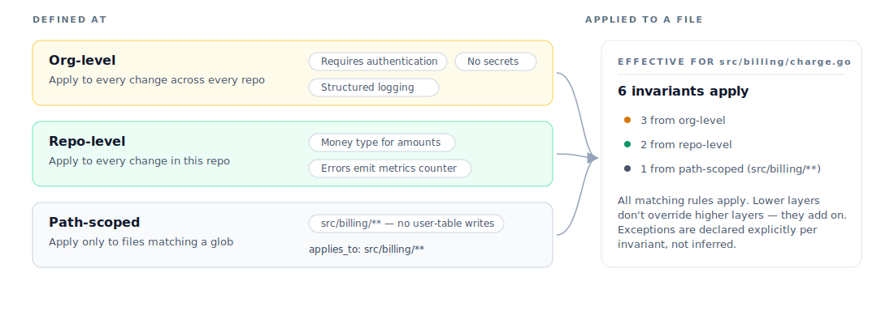

# Invariants

An **invariant** is a team-defined rule that Verify applies to every change it matches. Where acceptance criteria describe what *this* change should do, invariants describe what *every* change should respect. They live in your Aviator org and update once for everyone.

A good invariant captures something your team learned the hard way — usually as a recurring review comment — so reviewers don't have to flag it again.

### Scope: org, repo, path

Invariants are defined at three layers of scope. All matching layers are unioned at verification time for any file the change touches.

<figure><figcaption><p>The effective ruleset for a file is the union of every layer that matches it</p></figcaption></figure>

| Layer           | Configured by    | Typical use                                                                            |
| --------------- | ---------------- | -------------------------------------------------------------------------------------- |
| **Org-level**   | Org admins       | Security baseline, audit logging, secrets handling                                     |
| **Repo-level**  | Repo maintainers | Code-style rules, type conventions, error patterns specific to a service               |
| **Path-scoped** | Repo maintainers | Module rules — billing, auth, data access — gated by a glob                            |

Lower layers don't override higher layers. They add on. A change in `src/billing/charge.go` is checked against every org-level invariant, every repo-level invariant for this repo, *and* every path-scoped invariant whose glob matches `src/billing/charge.go`.

If you find yourself wanting to write "do X *except* when Y," that's an exception — declare it explicitly on the invariant rather than splitting the rule across scopes.

### When invariants fire

An invariant matches a change when:

1. **Its scope matches a modified file.** Org-level always matches. Repo-level matches if the change is in that repo. Path-scoped matches if any modified file matches its glob.
2. **Its trigger condition matches the change.** Most invariants have an implicit "if a file under scope is modified" trigger. Some are explicit — e.g. "fire only when a new HTTP handler is added," not on every edit under `src/handlers/`.

If multiple invariants match the same criterion shape, they all run. Each produces an independent verdict.

### What invariants cover

Invariants are good for rules you'd otherwise have to repeat. The categories that recur across teams:

| Category               | Examples                                                                                  |
| ---------------------- | ----------------------------------------------------------------------------------------- |
| **Security**           | All HTTP handlers require auth; SQL uses parameterized queries; no hard-coded secrets     |
| **Data access**        | User-record writes go through `UserRepository`; no direct `users` table mutation elsewhere |
| **Performance**        | New endpoints must declare a P99 budget; no N+1 patterns in `*Repository.list*` methods   |
| **Observability**      | Errors emit a metrics counter; log lines use the structured logger, not `fmt.Print`       |
| **Dependency hygiene** | No new direct deps without an architecture review; banned packages stay banned            |
| **Style/conventions**  | All amounts use the `Money` type; UUIDs serialized as strings, not bytes                  |

Avoid using invariants for things that change per task. "This endpoint returns these fields" is acceptance criteria — specific to the change. "Every endpoint requires auth" is an invariant — same across every change.

### Invariants vs. acceptance criteria

Both produce per-criterion verdicts in the same review document. The difference is where they come from:

|              | Acceptance criteria          | Invariants                  |
| ------------ | ---------------------------- | --------------------------- |
| Defined by   | The agent, from the intent   | Your team, ahead of time    |
| Scope        | This change only             | Every matching change       |
| Stored in    | The submitted spec           | Your Aviator org            |
| Updated      | Every new intent             | Rarely                      |

A typical change has 3–7 acceptance criteria and a handful of invariants that happened to match. Both are verified the same way and appear together in the review document.

### Writing a good invariant

Three rules of thumb:

**Be specific about the assertion, vague about the implementation.**

* ✓ "All HTTP handlers must call an authentication middleware before any business logic."
* ✗ "Use `AuthMiddleware` from `src/auth/middleware.go`." (Brittle — the check should survive renames and module moves.)

**Make the rule verifiable in isolation.**

A rule that requires running the whole system is hard to verify. Prefer rules that can be checked from the diff or from a single scenario.

* ✓ "All migrations must declare a `down` block."
* ✗ "All migrations must be reversible." (Can't be checked without running them backwards.)

**Declare exceptions on the invariant, not in every spec.**

* ✓ Invariant: "All HTTP handlers require auth. Exceptions: `/health`, `/ready`, `/live`, `/metrics`."
* ✗ Adding "this endpoint does not require auth" to every health-check spec.

### Turning a review comment into an invariant

Most invariants worth writing start as a review comment that's been left more than twice.

1. **Find the recurring comment.** Scan PRs over the last quarter. If you've written "use the structured logger" four times, that's an invariant.
2. **Write the assertion.** State the rule in one sentence. Leave out the *fix* — the verifier will explain what's wrong; you only need to say what's required.
3. **Set scope.** Org-wide, repo, or path? Default to the narrowest scope that still captures the pattern. You can broaden later.
4. **List the exceptions.** Every real rule has them. Write them down now or you'll get noise on every verification.
5. **Ship it as draft, watch a week of verifications.** Draft invariants produce verdicts but don't block. Use that to confirm the rule fires only where you want.

Example — turning a real review comment into an invariant:

> Comment on PR #4173: "Please don't write to `users` directly — go through `UserRepository.UpdateProfile`. We had a partial-write bug last quarter from a similar pattern."

Invariant:

```yaml
name: user-writes-through-repository
applies_to: src/**/*.go
exclude:
  - src/users/repository/**
  - src/db/migrations/**
rule: |
  Writes to the users table must go through UserRepository.
  Direct INSERT, UPDATE, or DELETE statements against the users
  table are not allowed outside the repository package.
exceptions:
  - Test fixtures under tests/**
```

This invariant fires on every Go change, ignores the repository implementation and migrations, and explains the *what* (no direct writes) without prescribing the *how* (which repository method to call — that's not the invariant's job).

### Exceptions

Every rule has exceptions. Two ways to declare them:

* **On the invariant itself.** Use `exclude` for path patterns and `exceptions` for specific behavioral carve-outs. This is the right place 95% of the time.
* **In the intent.** If a particular change legitimately needs to break an invariant, the agent can call it out in the intent. The reviewer sees the invariant verdict as `Waived — see intent` rather than passing silently. The exception is recorded in the audit trail.

Avoid the third path — turning off the invariant globally. If an invariant produces enough noise that you want to disable it, the rule is probably wrong. Tighten the scope or rewrite the assertion.

### See also

* [Setting up org invariants](../setting-up-org-invariants.md) — step-by-step setup
* [Verification layers](verification-layers.md) — how invariants stack with criteria
* [How verification works](how-verification-works.md) — the verifier pipeline
* [How to: Writing a SKILL.md](../how-to-guides/writing-a-skill-md.md) — for scenario context, not rules
