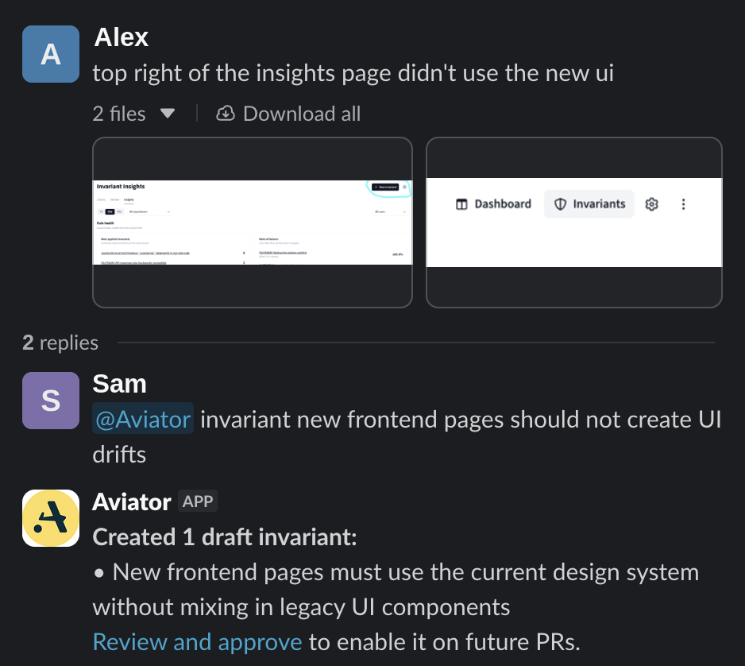
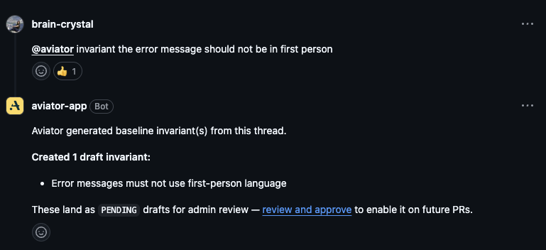

# Invariants

An **invariant** is a team-defined rule that Verify applies to every matching change. Where user-supplied acceptance criteria describe what *this* change should do, invariants describe what *every* change should respect. They live in your Aviator account and update once for everyone.

A good invariant captures something your team learned the hard way — usually as a recurring review comment — so reviewers don't have to flag it again.

### Where invariants come from

Invariants live in a per-account catalog. Each invariant has a source:

| Source                  | What it is                                                                                    |
| ----------------------- | --------------------------------------------------------------------------------------------- |
| **Manual**              | Authored by an admin in **Settings → Invariants**.                                           |
| **Template**            | Instantiated from Aviator's starter library — common patterns you can adopt as-is or tweak. |
| **AI-generated**        | AI-drafted from signals about the repo, awaiting admin approval.                             |
| **AI from docs**        | Extracted from your repo's `CONTRIBUTING.md`, `LLM.md`, or similar files by the docs pipeline. |
| **AI from PR comments** | Mined from your team's recurring PR-review comments. Often the highest-yield source — it captures real-world feedback your team has already given. |
| **Slack**               | Drafted on request from a `@Aviator invariant` command in Slack.                              |
| **GitHub comment**      | Drafted on request from a `@aviator invariant` comment on a pull request.                     |

Sources that aren't `manual` produce drafts. Admins promote drafts to active in the UI; that's when they start producing verdicts.

### Creating invariants from Slack

Mention the Aviator Slack app in a channel, or DM it, with `@Aviator invariant [repo-name] <rule description>`; when used inside a thread, the thread's messages become context for the draft, and naming a repository scopes the invariant to it (otherwise it applies account-wide). Aviator replies in the thread with the draft titles and a link to review and approve them.

<figure><figcaption><p>Turning a Slack thread into a draft invariant</p></figcaption></figure>

### Creating invariants from a GitHub comment

Include `@aviator invariant` in any pull request comment (a regular comment, an inline review comment, or a review body) and Aviator acknowledges with a 👍 reaction, then drafts invariants from the comment and its surrounding discussion. This trigger is limited to repository maintainers; Aviator replies on the pull request with the draft titles and a link to review and approve them.

<figure><figcaption><p>Turning a PR comment into a draft invariant</p></figcaption></figure>

### Owner teams

Every invariant can have an **owner team**: the GitHub team responsible for the rule. Aviator picks it automatically when the invariant is created, so you know who to ask when a rule fires on a change it shouldn't have. Ownership is a label. It doesn't change which changes an invariant applies to, how it's verified, or who can edit it.

Owner teams come from your GitHub organization's teams, including nested teams, as synced by the Aviator GitHub app.

#### How the owner is picked

Aviator looks at the people behind the invariant and picks the most specific team they all belong to. Which people count depends on where the invariant came from:

| Source                  | People considered                                                                                     |
| ----------------------- | ----------------------------------------------------------------------------------------------------- |
| **Manual**              | The person who created it.                                                                            |
| **AI from docs**        | The admin who started the docs extraction.                                                            |
| **Slack**               | The person who ran `@Aviator invariant`.                                                              |
| **GitHub comment**      | The person who wrote the `@aviator invariant` comment, and the pull request's author.                 |
| **AI from PR comments** | The authors, reviewers, and commenters on the pull requests the invariant was mined from (up to five). |

A few details worth knowing:

* **Parent teams count.** Someone in `payments-api`, a child of `payments`, also belongs to `payments`. If one person is in `payments-api` and another in `payments-web`, the owner is `payments`.
* **People with no team are ignored.** An outside contributor or someone who isn't in any team doesn't stop the others from deciding the owner.
* **No shared team means no owner.** If the people involved don't all share a team, Aviator doesn't guess. The invariant falls back to the default owner team.
* **The owner is set once, at creation.** Approving, editing, or reorganizing your GitHub teams later doesn't move it.
* **Deleted teams fall back to the default.** If the owner team is removed from GitHub, the invariant goes back to the default owner team.

#### Default owner team

Admins can set a **Default invariant owner team** in **Verify → Settings → Verify**. It owns every invariant that didn't get a team of its own, across all repositories.

The default is applied when an invariant is shown, not copied onto it. Changing the default immediately re-owns every invariant without a team, including ones created before you set it. Invariants with a team of their own keep it. Non-admins can see the default but not change it.

If there's no default either, the invariant shows as **Unowned**.

#### Where owners appear

* The invariant list shows "Owned by @team" on each row.
* Draft invariants waiting for review show their owner, so you can check it before you approve the rule.
* The invariant's edit page shows the owner in a read-only **Owner** field.

#### Filtering by owner team

The invariants page and the draft review page have an **Owner team** filter. Pick one or more teams, **Unowned**, or both, to narrow the list. Invariants without a team of their own are counted under the default owner team. The filter only appears when there's more than one option to choose from.

### Conditions

Each invariant has zero or more **conditions** that gate when it's eligible to apply:

| Condition type   | What it matches                                                |
| ---------------- | -------------------------------------------------------------- |
| `file_path_glob` | Files changed in the review match a glob like `src/**/*.py`. |
| `language`       | The detected language of changed files matches.                |

An invariant with no conditions is eligible for every review. With conditions, it's eligible when at least one changed file satisfies them. See [Invariant conditions](../reference/invariant-conditions.md) for the exact matching rules and examples.

Eligibility doesn't mean the invariant *applies* — it just means the next step (selection) will consider it.

### Categories

Every invariant belongs to a category. Default categories:

| Category                    | What it covers                                                                |
| --------------------------- | ----------------------------------------------------------------------------- |
| `functional_correctness`    | The change behaves correctly for expected and edge-case inputs.               |
| `test_coverage`             | New and changed code is covered by meaningful tests.                          |
| `security`                  | The change avoids common vulnerabilities and enforces required controls.     |
| `performance`               | The change doesn't introduce avoidable latency, memory, or query regressions. |
| `accessibility`             | UI changes meet accessibility standards.                                      |
| `observability`             | Errors emit metrics; logging uses structured fields.                          |
| `backwards_compatibility`   | Public surfaces don't break existing consumers.                               |
| `documentation`             | Public APIs and behavior changes are documented.                              |
| `code_style`                | Code follows team conventions (type usage, naming, layering).                |

Categories drive grouping in the UI and reporting in the audit trail.

### How invariants apply to a review

When a review is created, a **selector** picks which eligible invariants actually apply. The selector reads the review's intent, the user-supplied acceptance criteria, and the change set, and uses an LLM to pick the catalog entries that defensibly fit the change.

Selected invariants are materialized as acceptance criteria on the review, tagged with `source: baseline_invariant`. From that point on, they flow through the [verification pipeline](how-verification-works.md) like any other criterion — same verdict shape, same evidence, same review-document treatment.

Two consequences:

* **You don't need to think about invariants when writing the intent.** The selector handles eligibility. Your acceptance criteria stay focused on what's specific to this change.
* **Invariant verdicts and user-criterion verdicts look identical in the review document.** The only visible difference is the source tag, and the fact that invariant criteria can't be edited per review (they can be waived).

### Writing a good invariant

Three rules of thumb:

**Be specific about the assertion, vague about the implementation.**

* ✓ "All HTTP handlers must call an authentication middleware before any business logic."
* ✗ "Use `AuthMiddleware` from `src/auth/middleware.go`." (Brittle — the check should survive renames and module moves.)

**Make the rule verifiable in isolation.**

A rule that requires running the whole system is hard to verify. Prefer rules that can be checked from the diff or from a single runtime probe.

* ✓ "All migrations must declare a `down` block."
* ✗ "All migrations must be reversible." (Can't be checked without running them backwards.)

**Scope it to where it can be broken.**

Use conditions to limit a rule to the files where it can be violated, for example a frontend rule to `web/**`. Verify skips an invariant when none of the changed files match its conditions.

### Turning a review comment into an invariant

Most invariants worth writing start as a review comment that's been left more than twice. The mining pipeline — `ai_generated_pr_comments` — does this automatically by reading your PR history, but you can also do it by hand:

1. **Find the recurring comment.** Scan PRs over the last quarter.
2. **Write the assertion.** State the rule in one sentence. Don't write the *fix* — the verifier will explain what's wrong.
3. **Pick a category.** Helps with grouping and reporting.
4. **Add conditions if needed.** Most invariants don't need them.
5. **Save as draft, watch a week of verifications.** Draft invariants don't get materialized into reviews. Use that to confirm the rule reads cleanly before promoting to active.

Example, turning a real review comment into an invariant:

> Comment on PR #4173: "Please don't write to `users` directly — go through `UserRepository.UpdateProfile`. We had a partial-write bug last quarter from a similar pattern."

Invariant body:

```
Writes to the users table must go through UserRepository. Direct INSERT,
UPDATE, or DELETE statements against the users table are not allowed
outside the repository package. Schema migrations under src/db/migrations
are exempt.
```

Conditions: `file_path_glob: src/**/*.go` (skip non-Go files).

Category: `functional_correctness`.

### Waivers

Invariant verdicts can be waived with a categorized reason, from the review document, from the [Verify tab on the pull request](../how-to-guides/verify-on-github.md), or with [`aviator dismiss`](../reference/cli.md#aviator-dismiss):

| Waiver category    | When to use it                                                                 |
| ------------------ | ------------------------------------------------------------------------------ |
| `false_positive`   | The invariant fired but the rule misjudged this case.                          |
| `doesnt_apply`     | The rule is valid in general but isn't relevant to this PR.                    |
| `accepted_risk`    | The failure is real but the PR author accepts the trade-off.                   |
| `fix_in_followup`  | The failure is real and will be addressed in a separate follow-up PR.          |

Every waiver is recorded in the audit trail with the reviewer, the category, and the free-text reason. If you find yourself waiving the same invariant repeatedly, the rule is wrong — tighten its conditions, rephrase the body, or rebuild the rule from real review comments.

### See also

* [Setting up org invariants](../setting-up-org-invariants.md) — step-by-step setup
* [Managing invariants with the CLI](../how-to-guides/managing-invariants-with-the-cli.md)
* [Verification layers](verification-layers.md) — how invariants compose with criteria in a run
* [How verification works](how-verification-works.md) — the verifier pipeline
* [How to: Writing a SKILL.md](../how-to-guides/writing-a-skill-md.md) — for runtime context, not for rules
