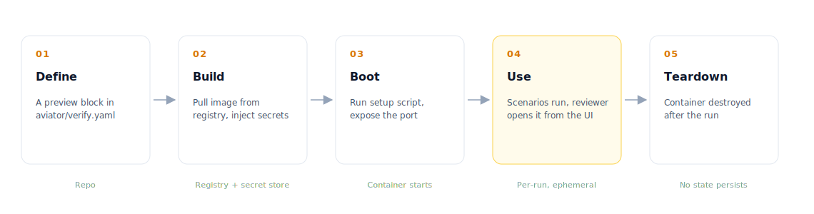

# Previews

A **preview** is an ephemeral environment Verify builds on demand and runs scenarios against. It's how Verify makes behavioral claims real — every "the endpoint returns X" criterion needs the code to actually run somewhere, and the preview is that somewhere.

A preview is short-lived: built per run, used by the scenario runner (and optionally a human reviewer), then torn down. No state persists between runs.

### Optional, not required

Previews are optional. Verify works on day one with code-scan alone — without a preview, every criterion is routed to code-scan (static analysis of the diff) and you get verdicts on structural criteria from the first PR.

A preview unlocks **runtime verification**: behavioral criteria like "the endpoint returns 429" or "the modal closes on submit" need the code to actually run, and that requires a preview. Most teams get going with code-scan and add a preview when their criterion list starts asking about behavior the diff alone can't answer.

### Lifecycle

<figure><figcaption>
A preview moves through five phases per verification run
</figcaption></figure>

| Phase        | What happens                                                                                |
| ------------ | ------------------------------------------------------------------------------------------- |
| **Define**   | The repo declares the preview in `aviator/verify.yaml`.                                     |
| **Build**    | Aviator boots a container from the cached image and prepares the environment.                |
| **Boot**     | The setup script runs. The declared port becomes reachable.                                  |
| **Use**      | Scenarios execute against the preview. Reviewers can also open it from the UI.               |
| **Teardown** | The optional teardown script runs. The container is destroyed. No state survives.            |

Every verification run starts fresh. That's deliberate — a preview that carries state from a previous run produces non-reproducible verdicts.

### Composition

A preview is composed of inputs from three places: a preview image, your secret store, and your repo.

<figure><figcaption>
Where each piece of a preview comes from, and what uses it
</figcaption></figure>

* **Image** — a preview image registered with Aviator for your account. Aviator caches the image locally and boots containers from it. Register images through **Settings → Sandboxes** in the Aviator UI.
* **Secrets** — runtime secrets (DB passwords, API keys) referenced by name from the account secret store and injected as environment variables when the container boots.
* **Setup script** — optional. Runs after the container starts and before the port is marked ready. Used for migrations, seeding, warm-up.
* **Teardown script** — optional. Runs before destruction to release external resources.
* **Port** — the port the runner connects to. The container is considered ready when this port accepts connections.

Aviator stitches these together into a single ephemeral container. The repo's `verify.yaml` is the contract — see [Preview YAML reference](../reference/preview-yaml.md) for every field.

### Multiple previews per repo

A repo can declare more than one preview. Common patterns:

| Pattern                        | Why                                                                                   |
| ------------------------------ | ------------------------------------------------------------------------------------- |
| **`default`** only             | Single API or service. One image, one set of secrets.                                 |
| **`default` + `mirror`**       | The mirror preview points at a more production-like configuration — bigger seed data, real third-party sandboxes. Used by scenarios that need higher fidelity. |
| **`api` + `worker` + `db`**    | Multi-service apps. Each scenario picks the preview that matches the code it touches. |
| **`light` + `heavy`**          | Light boots fast and is used by most scenarios. Heavy boots slow but covers integration tests that need full setup. |

Scenarios target a preview by name. If no name is set, scenarios run against `default`.

### When previews are used

Previews only spin up when the verification run has at least one **runtime** criterion — a criterion the classifier decides needs to be checked against the running code (see [How verification works](how-verification-works.md)). If every criterion can be verified by code-scan alone, no preview is built and the run finishes faster.

This matters for cost: previews are the expensive part of verification. The classifier minimizes their use by routing structural assertions away from the runtime path when possible.

### Reviewer access

The review document exposes a per-run "Open preview" link. Clicking it gives the reviewer access to the same ephemeral container the scenarios ran against — same data, same configuration, same code under test.

The link expires when the preview is torn down (default: shortly after the run completes). If you need a long-running review session, ask Aviator to extend the preview from the UI.

### Previews vs. CI environments

Previews look like CI environments but they're not the same thing:

|                    | Preview                              | CI environment                        |
| ------------------ | ------------------------------------ | ------------------------------------- |
| Triggered by       | Verify run                           | Push, PR open, schedule               |
| Lifespan           | Per run (minutes)                    | Per job (minutes to hours)            |
| Configured in      | `aviator/verify.yaml`                | CI provider config (GH Actions, etc.) |
| Used by            | Scenario runner + reviewer           | Test runners, build pipeline          |
| Purpose            | Make behavioral verification real    | Run the test suite, ship artifacts    |

### See also

* [Preview YAML reference](../reference/preview-yaml.md) — the schema
* [Creating a preview](../how-to-guides/creating-a-preview.md) — walkthrough
* [Managing previews](../how-to-guides/managing-previews.md) — bake vs. setup, refresh, cleanup
* [Seed data for previews](../how-to-guides/seed-data-for-previews.md) — fixtures and deterministic state
