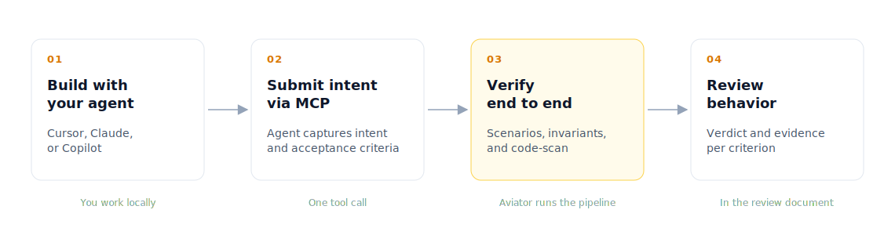

# How Verify works

Verify replaces line-by-line code review with verification of *what the change is supposed to do*. You work with your agent locally. Aviator captures your intent through an MCP call, runs every acceptance criterion against the running code, and produces a review document with verdicts and evidence.

<figure><figcaption>
The end-to-end Verify loop
</figcaption></figure>

The full loop:

1. **Build with your agent.** Implement the task with Cursor, Claude, Copilot, or anything else you use today. No new tooling, no behavior change.
2. **Submit intent via the Aviator MCP.** When you're done, the agent calls one MCP tool. It captures the intent you and the agent agreed on and the acceptance criteria from what was built.
3. **Aviator verifies end to end.** Every criterion runs through the verification pipeline — scenarios execute in your preview, invariants match against the change, code-scan handles structural checks, an LLM fallback catches the rest.
4. **Review the behavior.** The reviewer sees the intent, the verdict per criterion, and the evidence behind each verdict. They can approve, waive with reason, or ask for another scenario on the spot.

### What gets submitted

The MCP call carries two things:

- **Intent** — a short statement of *what* this change is for. It carries the constraints that aren't visible from the diff alone.
- **Acceptance criteria** — verifiable assertions the change must satisfy. Each criterion is independent and has a clear pass/fail shape.

The agent generates both from what was actually built. You submit *after* implementing, not before — there is no separate "approve the spec first" step.

### The verification pipeline

Every criterion runs through exactly one verifier. The classifier picks the verifier based on the criterion text and the files the change touched.

<figure><figcaption>
Each criterion is classified and routed to a single verifier
</figcaption></figure>

| Verifier         | Used for                                                                              | Evidence captured                          |
| ---------------- | ------------------------------------------------------------------------------------- | ------------------------------------------ |
| **Code-scan**    | Structural assertions: file scope, dependency surface, function signatures            | The diff snippet that proves the assertion |
| **Scenario**     | Behavioral assertions: endpoint contracts, error shapes, side effects                 | The scenario run output from a preview     |
| **Invariant**    | Team-defined rules: security, perf budgets, data access patterns                      | The matched rule and the offending snippet |
| **LLM fallback** | Criteria that don't fit cleanly anywhere                                              | Reasoning trace with cited code            |

Most criteria resolve through Code-scan and Scenario. Invariants run alongside — they apply automatically based on what the change touches.

→ [Concepts: Invariants](concepts/invariants.md)

### Why previews matter

Behavioral criteria need the code to actually run. Aviator builds an ephemeral preview environment per run: it pulls your image, injects secrets, runs a setup script, and exposes the port the scenarios hit. The reviewer can also open the preview from the review document to explore it manually.

A repo can declare multiple previews — staging, sandbox, prod-mirror — and tag scenarios to the one they need.

### The review document

The review document is the surface reviewers actually use. Three regions:

1. **Intent** — what you and the agent agreed to build.
2. **Evidence** — every criterion with its verdict and the proof.
3. **Decisions** — request another scenario, open the preview, approve, or waive with reason.

The reviewer is judging behavior and intent — not the diff. The diff is still there if you want it, but it's not the primary surface.

### Audit and compliance

Every step is recorded as an immutable event: intent submitted, who submitted it, criteria generated, verifier and verdict per criterion, evidence captured, reviewer decisions, exceptions and waivers. Compliance teams export this log as a single audit trail per change.

→ [Audit trails and compliance](concepts/audit-trails-and-compliance.md)

### Running with remote agents

If you'd rather not run the agent locally, Aviator Runbooks runs the implementing agent inside a sandbox, calls the same MCP, and waits for verification. The verification path is identical — only the agent's location changes. Useful for batch work, off-hours runs, or non-developer-driven changes.

### See also

- [Setting up org invariants](setting-up-org-invariants.md)
- [Concepts: Invariants](concepts/invariants.md)
- [How to: Writing a SKILL.md](how-to-guides/writing-a-skill-md.md)
- [Concepts: Verification layers](concepts/verification-layers.md)
- [Reference: Spec format](reference/spec-format.md)
