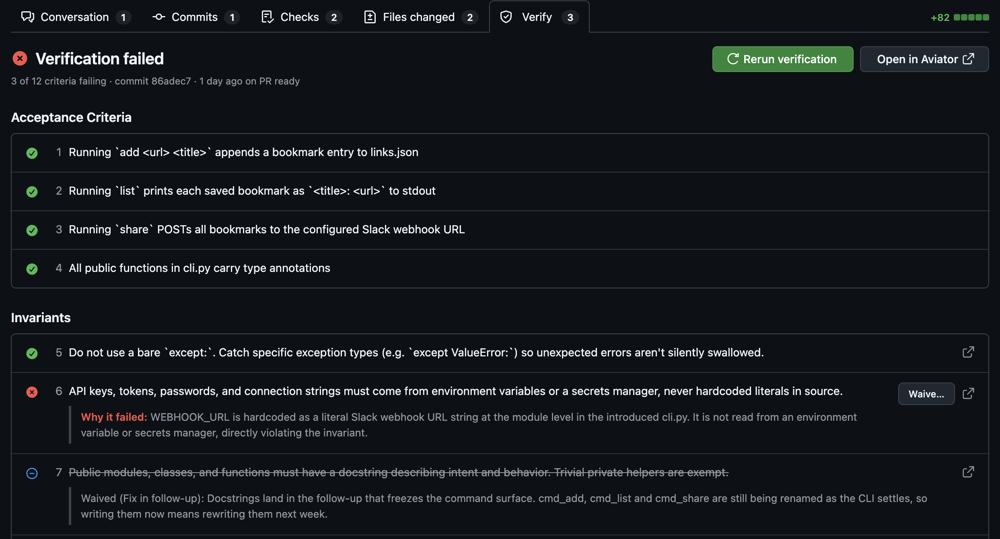
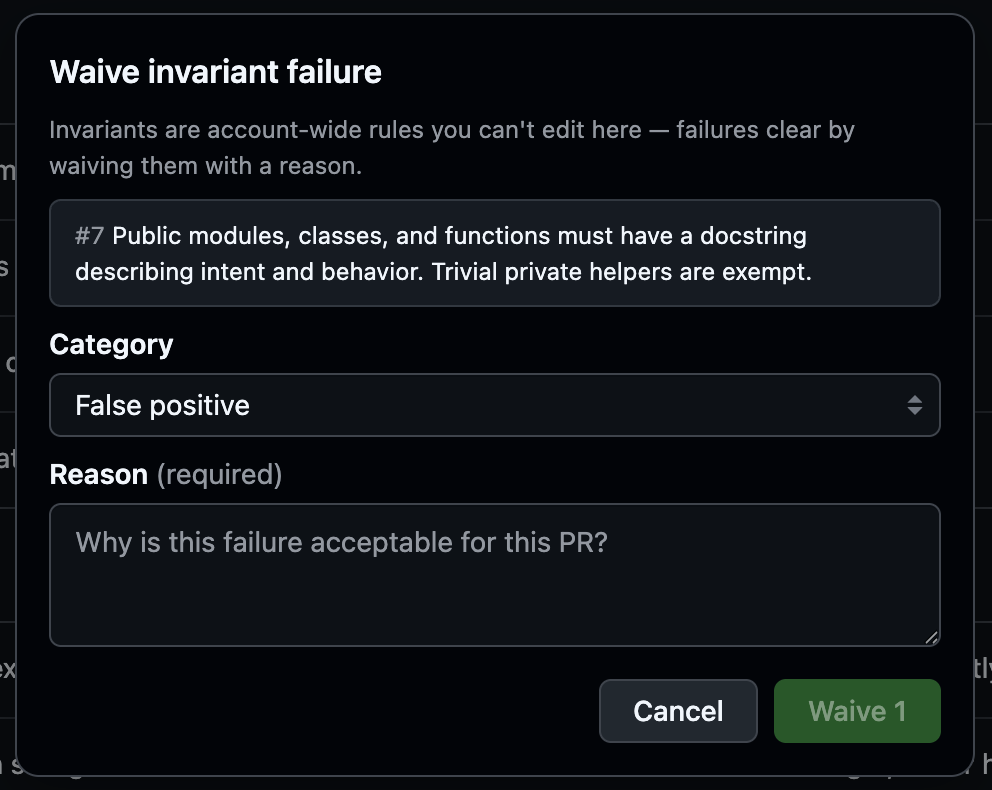

# Review verification on the pull request

With the [Aviator Chrome extension](../../mergequeue/aviator-chrome-extension.md), a **Verify** tab appears in the pull request's tab row, next to Files changed. It's a trimmed-down, live view of the review document, so you can see why verification failed and unblock the PR without leaving GitHub.

<figure><figcaption>
The Verify tab on a pull request with a failing run
</figcaption></figure>

### Prerequisites

* The [Aviator Chrome extension](../../mergequeue/aviator-chrome-extension.md) installed and signed in to Aviator.
* The pull request has a verification run. The tab only appears once a run exists; PRs without one show nothing.
* An Aviator backend on version `2026.07.16-2` or newer. Aviator Cloud is always current. A self-hosted deployment older than that doesn't serve the data the tab reads, so the tab stays hidden.

### What it shows

The tab opens in place of GitHub's content and mirrors the review document:

* **The run outcome** — passed, passed with N accepted failures, failed, errored, in progress, or deferred (waiting on invariant selection).
* **The verified commit** and when and why the run happened (for example, "9 days ago on queue").
* **Every criterion and invariant** with its verdict icon and, for failing rows, the reason it failed. Invariants appear in their own section and link to their invariant page.
* **Waived rows** are struck through and show the waiver's category and reason.

The outcome tracks the `aviator/verify` check, so the tab never disagrees with it — a run that failed but has every failure waived reads as passed with accepted failures. Live updates arrive on their own; you don't need to refresh.

Use **Open in Aviator** for the full review document (evidence, scenarios, run history).

### Rerun verification

Select **Rerun verification** to start a new run against the PR's latest commit. It's unavailable while a run is in progress, and when the runbook has no open PR to verify against it explains why.

### Waive an invariant failure

Failing invariant rows offer **Waive…**. Invariants are account-wide rules you can't edit here, so failures clear by waiving them:

1. Pick a category — **False positive**, **Doesn't apply**, **Accepted risk**, or **Fix in follow-up**.
2. Give a reason (required).
3. Confirm. The failure clears, the counter and header update, and the `aviator/verify` check is re-posted.

<figure><figcaption>
Waiving an invariant failure with a category and a reason
</figcaption></figure>

### Remove an acceptance criterion

Failing acceptance-criteria rows offer **Remove…**, which drops a criterion you don't want verified. The last remaining criterion and account invariants can't be removed; when the backend refuses, the tab tells you why.

### Related

* [Fixing verification failures](fixing-verification-failures.md) — the failure shapes and how to resolve each.
* [GitHub integration](../reference/github-integration.md) — the `aviator/verify` check and its states.
