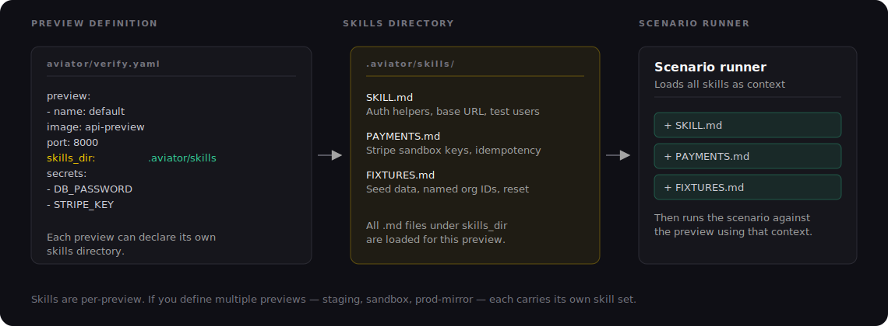

# Writing a Verify skill

A **Verify skill** is a short markdown file that tells Verify how to drive your running app — how to sign in, what's worth checking, and where things live. It's the app-specific knowledge the agent can't infer from your code alone.

Verify reads your skill at two points:

* **Planning** — when Verify turns an acceptance criterion into test scenarios, it reads your skill to ground the plan in your real login flow, routes, and what the preview can actually show.
* **Running** — when it drives a headless browser against your preview to capture evidence, it follows your skill's sign-in steps and navigation.

The test for what belongs here: the things a new engineer would have to ask before they could test your app sensibly are exactly what goes in a skill.

### Where the skill lives

Each preview has one **entry-point** skill at `.aviator/verify/skills/<preview-name>.md`, named after the preview it describes. So the `default` preview reads `.aviator/verify/skills/default.md`.

The entry point can **reference other files** in your repo. If your guidance grows, split it by concern and point at the pieces from the entry point — Verify reads those too, in place:

```
.aviator/verify/skills/
├── default.md   # entry point — points at the files below
├── auth.md      # how to sign in
└── app.md       # navigation + what's observable
```

<figure><figcaption><p>Verify reads your skill — and any files it references — before planning and running scenarios.</p></figcaption></figure>

The skill is read from the **commit under verification**, so it versions with your code — update it in the same change that alters the behavior.

To point a preview at a file somewhere other than the default location, set `verify_skill`:

```yaml
preview:
  - name: default
    image: api-preview
    port: 8000
    verify_skill: docs/verify/main.md
```

`verify_skill` is a single repo-relative path; when set, it replaces the default `<preview-name>.md` lookup for that preview. See [Preview YAML](../reference/preview-yaml.md).

### Credentials: never hard-code them

When a flow needs to log in, **don't put real credentials in the skill.** Store them as account secrets (**Settings → Secrets** in the Aviator UI) and reference them by name with a `{{ secrets.<name> }}` placeholder:

```markdown
# Signing in

The app redirects to `/login` on first load. To sign in:

1. Navigate to the preview URL.
2. Fill the email field with `{{ secrets.app_admin_email }}`.
3. Fill the password field with `{{ secrets.app_admin_password }}`.
4. Click "Log in".
```

When Verify drives the browser it substitutes the real value at the moment it fills the field. The value never appears in the skill, the plan, the prompt, or the run transcript — only the placeholder does. You can reference any account secret this way, and placeholders also work embedded in a string (e.g. `Authorization: Bearer {{ secrets.api_token }}`).

> This is separate from a preview's `secrets:` list, which injects secrets as **environment variables into the preview container** so your app can boot. The same secret store backs both — `{{ secrets.* }}` is specifically for credentials Verify types into your UI. See [Preview YAML → Secrets](../reference/preview-yaml.md).

### What to include

Aim for the smallest set of facts that lets Verify run a scenario without trial and error:

| Category                 | What to write                                                                                  |
| ------------------------ | ---------------------------------------------------------------------------------------------- |
| **Sign-in**              | The login flow, step by step, with `{{ secrets.* }}` placeholders for credentials.             |
| **What's observable**    | What the running preview can and can't show (see below).                                       |
| **Navigation**           | Key routes and how to reach important screens. "The article list is at `/unread/list`."        |
| **Test data / fixtures** | Named records in the seeded data, referenced by stable name, not ID.                           |
| **Side effects**         | What's real vs. mocked. "Stripe runs in test mode — no real charges. Email sends are dropped." |
| **Gotchas**              | Things that bit a previous run. "First request after boot takes ~3s due to JIT warmup."        |

### Tell Verify what's observable

This is the most valuable thing a skill adds. Verify confirms a criterion by **driving the running app and watching what it does** — rendered UI, DOM, computed styles, console output, API responses. It can see that the app *initiated* something, but not a result that a background job, queue, or external system has to produce.

So call out what your preview can and can't exercise:

```markdown
## What's observable here
This is the full web UI driven through a browser, so rendered state, DOM,
computed styles, and console output are all fair game. Background workers and
outbound email are NOT exercised in the preview — don't try to verify anything
that depends on them.
```

This keeps Verify from burning a run trying to confirm something the preview structurally can't show — it verifies the responsible code path instead.

### What to leave out

Verify can already read your code. Don't repeat what it can see:

* **Architecture descriptions.** "We use Express with Postgres" — the agent can see this. Don't restate it.
* **Endpoint catalogs.** It will discover endpoints from the router. You don't need to list them.
* **Code conventions.** That's invariants, not skills. ([Invariants](../concepts/invariants.md))
* **Implementation history.** "We used to use library X, switched to Y in 2024." Irrelevant for running scenarios.
* **The change under test.** That's the intent, submitted via MCP per change.

A bloated skill hurts more than a thin one. Every irrelevant line dilutes the context and slows the agent down.

### Example

A `default.md` entry point that references two more files in the same directory:

`default.md`:

```markdown
# App verify guidance

Read both of these files (same directory) before planning or driving:

- `auth.md` — how to sign in.
- `app.md` — getting around, and what the preview can exercise.
```

`auth.md`:

```markdown
# Signing in

The app gates everything behind a login form at `/login`.

1. Navigate to the preview URL.
2. Fill the email field with `{{ secrets.app_admin_email }}`.
3. Fill the password field with `{{ secrets.app_admin_password }}`.
4. Click "Log in" — you land on the dashboard.
```

`app.md`:

```markdown
# Driving the app

- The main view is a list of saved items, rendered as cards, at `/unread/list`.
- Settings live at `/config`; per-item actions (archive, star, delete) are on each card.

## What's observable here
Rendered UI, DOM, computed styles, and console output are all available as
evidence. Background jobs and outbound email are not exercised in the preview.
```

A single self-contained `default.md` works just as well — split into referenced files only when one file gets unwieldy.

### Tips

* **Keep it short.** If a file passes ~150 lines, split it into referenced files.
* **Lead with the facts that change behavior.** Sign-in and observability first; gotchas last.
* **Use stable identifiers.** Reference fixtures by name (`org "acme"`), not by ID. IDs change when seed data is regenerated.
* **Update the skill when you change the seed or the login flow.** A stale skill produces confidently wrong scenarios.
* **Never put a literal secret in a skill.** Use `{{ secrets.<name> }}` placeholders.

### See also

* [Concepts: Invariants](../concepts/invariants.md) — for rules that apply across changes
* [How Verify works](../how-it-works.md) — where skills fit in the verification pipeline
* [Preview YAML](../reference/preview-yaml.md) — `verify_skill` and `secrets`
