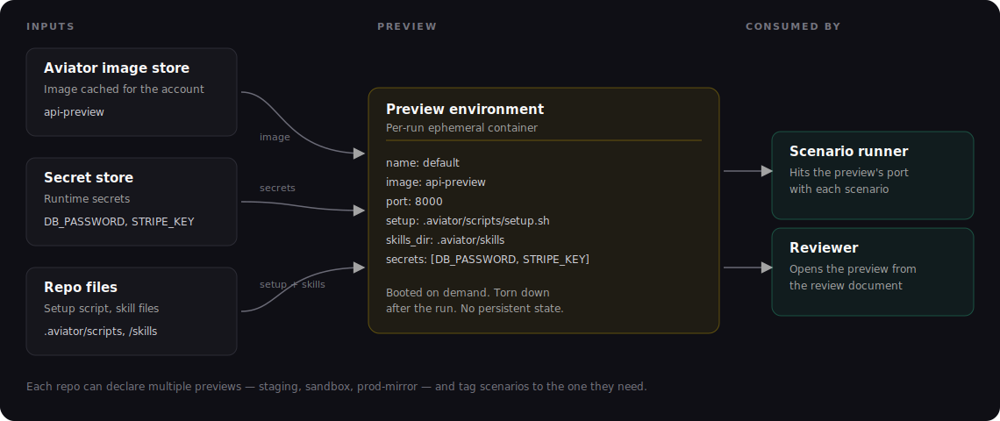

# Preview YAML reference

This page documents the `preview` block in `aviator/verify.yaml`. For the concept of what a preview is and how it fits in, see [Concepts: Previews](../concepts/previews.md).

### Shape

`preview` is a list. Each entry defines one preview.

```yaml
preview:
  - name: default
    image: sim-preview-baked-deps
    port: 8000
    setup: .aviator/scripts/preview-setup.sh
    secrets:
      - DB_PASSWORD
      - STRIPE_KEY
```

If a single preview is declared with no `name`, it's treated as `default`. Always set names explicitly when you have more than one.

### Fields

| Field      | Type            | Required | Description                                                                                              |
| ---------- | --------------- | -------- | -------------------------------------------------------------------------------------------------------- |
| `name`     | string          | no       | Unique name within the repo. Defaults to `default`. Scenarios target a preview by this name.            |
| `image`    | string          | yes      | Name of a preview image. Aviator caches the image locally and boots a container from it per run.        |
| `port`     | int             | yes      | Port the app serves on. Aviator handles exposing this as a public URL.                                   |
| `setup`    | string          | no       | Path (in the repo) to a setup script. Defaults to `.aviator/scripts/preview-setup.sh`. Runs after the container starts. |
| `teardown` | string          | no       | Optional path (in the repo) to a teardown script. Runs before the container is destroyed.                |
| `secrets`  | list of strings | no       | Account secret keys. Each is injected into the container as an environment variable of the same name.   |
| `verify_skill` | string | no | Repo-relative path to this preview's [Verify skill](../how-to-guides/writing-a-skill-md.md) entry point. Overrides the default `.aviator/verify/skills/<preview-name>.md` lookup. |

### Image

`image` is the name of a preview image registered with Aviator for your account. Aviator caches the image locally and boots a container from it for each verification run.

You can register an image through **Settings → Sandboxes** in the Aviator UI. The same image system backs both the preview environment and the coding sandbox — set both to the same image when you want them to share dependencies and tooling.

### Secrets

`secrets` is a list of secret keys defined on your account. Each name resolves to a value at boot time and is injected into the container as an environment variable of the same name:

```yaml
secrets:
  - DB_PASSWORD       # → env DB_PASSWORD=<resolved value>
  - STRIPE_KEY        # → env STRIPE_KEY=<resolved value>
```

Secrets are managed in the Aviator UI under **Settings → Secrets**. Scoped per account, granted to repos explicitly. The preview container never sees the unresolved name — only the value.

### Verify skill

By default, Verify reads this preview's app-driving guidance from `.aviator/verify/skills/<preview-name>.md` (the entry-point file may reference other files in the repo). To point the preview at a file elsewhere, set a single path:

```yaml
verify_skill: docs/verify/main.md
```

The path is repo-relative; when set, it replaces the default `<preview-name>.md` lookup. See [Writing a Verify skill](../how-to-guides/writing-a-skill-md.md).

### Setup script

`setup` runs inside the container after start. Use it for things that aren't baked into the image:

```bash
#!/usr/bin/env bash
set -euo pipefail

# Migrations
./bin/api migrate

# Light fixtures
./bin/api seed --fixture=tests/fixtures/preview.json
```

Two rules:

* **Idempotent.** The script runs every time the preview boots. Don't assume a clean slate elsewhere.
* **Fast.** Heavy work (large fixtures, dependency installs) should be baked into the image. Setup-time work is part of every run's latency.

See [Managing previews](../how-to-guides/managing-previews.md) for the bake-vs-setup tradeoff.

### Teardown script

`teardown` is optional. When provided, it runs before the container is destroyed. Use it to release external resources the preview acquired (e.g. a per-run tenant in a shared test environment).

### Anatomy

<figure><figcaption><p>How the YAML fields translate to a running preview</p></figcaption></figure>

### Examples

**Minimal:**

```yaml
preview:
  - name: default
    image: sim-preview-baked-deps
    port: 8000
    setup: .aviator/scripts/preview-setup.sh
    secrets:
      - PREVIEW_DB_PASSWORD
```

**Multi-preview repo:**

```yaml
preview:
  - name: default
    image: api-preview
    port: 8000
    setup: .aviator/scripts/preview-setup.sh
    secrets:
      - DB_PASSWORD
      - STRIPE_KEY
  - name: worker
    image: worker-preview
    port: 9000
    secrets:
      - DB_PASSWORD
      - QUEUE_URL
```

### See also

* [Concepts: Previews](../concepts/previews.md)
* [Creating a preview](../how-to-guides/creating-a-preview.md)
* [Managing previews](../how-to-guides/managing-previews.md)
