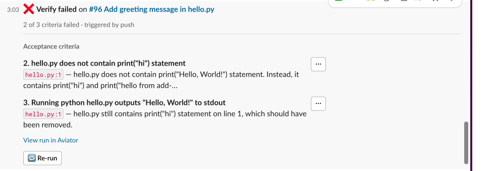

# Slack notifications

When a verification run finishes, Verify DMs the PR author the result — and lets them re-run verification, waive a failing invariant, or remove a failing criterion without leaving Slack.

For the underlying result shapes, see [Understanding verification results](understanding-verification-results.md).

### Prerequisites

* Your workspace has the Slack integration connected. See [Slack Integration Guide](../../api/personal-integrations.md#initial-slack-setup).
* The recipient has run `/aviator connect` and associated their GitHub handle with their Aviator user.
* **On-premise only:** the Slack app is created by hand, and needs **Interactivity** enabled for the action buttons to work — the DMs arrive without it, but clicking a button does nothing. See [Create your Slack App](../../manage/on-premise-installation/slack-integration.md#create-your-slack-app), in particular [Enable interactivity](../../manage/on-premise-installation/slack-integration.md#enable-interactivity).

### The thread model

Verify keeps **one thread per pull request**, in the PR author's DM with the Aviator app. The first notification posts the thread root; every later result posts as a reply, so the whole PR reads as one conversation.

The root doubles as a **live status summary** — it re-renders after each result, and after any waive or removal, rather than waiting for the next run.


Root edits are best-effort. If your workspace forbids message edits the summary can go stale; the thread replies stay complete, and the `aviator/verify` check is always authoritative.


### When a notification is sent

Verify sends **one notification per run**, and only on **terminal** run statuses:

| Run status                           | Behavior                                                                                                                    |
| ------------------------------------ | --------------------------------------------------------------------------------------------------------------------------- |
| `failed`                             | Always sent.                                                                                                                |
| `error`                              | Always sent — "Verify couldn't complete".                                                                                   |
| `passed`                             | Sent **only** if the previous completed run failed, as a recovery message. First-try passes are silent, and you never get two success messages in a row. |
| `pending`, `in_progress`, `deferred` | Not sent — no outcome yet. A deferred run posts normally once it actually runs.                                             |


Superseded runs — cancelled because a newer run replaced them — don't send a notification.


### Anatomy of the message

A failure summary looks like this:

```
❌ Verify failed on acme/api#482

3 of 7 criteria failed · ⚪ 1 waived · commit a1b2c3d · triggered by push

Acceptance criteria
  2. Returns 429 when the rate limit is exceeded                      ⋮
     src/api/limiter.go:88 — Handler responded 200 on the 11th request…

Baseline invariants
  5. auth-required-on-handlers                                        ⋮
     src/handlers/admin.go:23 — Handler does not call auth middleware…

…and 1 more — view all in Aviator

[ 🔁 Re-run ]
```

<figure><figcaption><p>A failure notification in Slack, with the per-criterion ⋮ menus and the Re-run button.</p></figcaption></figure>

#### Headline

| Condition                                        | Headline                          |
| ------------------------------------------------ | --------------------------------- |
| Run passed, or every remaining failure is waived | ✅ **Verify passing**              |
| Run failed with unwaived failures                | ❌ **Verify failed**               |
| Run errored                                      | ⚠️ **Verify couldn't complete**   |


**Passing with exceptions.** When every remaining failure is waived, the run's status stays `failed` — not every criterion literally passed — but the merge gate is green. Slack shows it as passing so it never contradicts the `aviator/verify` check for the same run.


#### Context line

A ` · `-joined summary: the **counts** (`X of Y criteria passing`, `X of Y criteria failed`, or `last run couldn't complete — not caused by your code`), the **waived count** when any, the **short commit SHA**, and a **trigger label** such as `triggered manually` — see [When a run is triggered](../concepts/how-verification-works.md#when-a-run-is-triggered). Unmapped triggers read `triggered automatically`.

#### Failure listing

* Only **active, unwaived** failures appear. Anything waived or deleted since the run drops out, matching the merge gate.
* Grouped into **Acceptance criteria** then **Baseline invariants**; an empty group is omitted.
* Entries are numbered by position in the criteria list. **These numbers match the GitHub check run**, so you can carry a number between surfaces.
* **At most 3** are shown; the rest collapse into `…and N more`.
* Each shows `file:line` when the verdict carried a location, plus the reason **truncated to 120 characters**.

Full evidence is never inlined in Slack — follow the link to the review document.

### Actions

| Control                 | Where it appears                                   | What it does                                    |
| ----------------------- | -------------------------------------------------- | ----------------------------------------------- |
| 🔁 **Re-run**           | Failed and errored summaries only                  | Re-runs verification on the PR                  |
| ⋮ **Waive failure…**    | Next to a failing **baseline invariant** criterion | Opens a modal to waive with a category + reason |
| ⋮ **Remove criterion…** | Next to a failing **acceptance criterion**         | Opens a confirmation modal to delete it         |

The ⋮ menu offers only the action that's legal for that criterion's type. Every action — success, refusal, or error — posts a visible reply in the thread; nothing fails silently.

#### 🔁 Re-run

Enqueues a fresh run and replies in the thread:

```
🔄 Re-running verification — results will post in this thread.
```

Rapid double-clicks collapse into a single run. If the enqueue fails, or Verify is no longer enabled for the account, the reply says so instead.

#### Waive failure

Opens a modal with two required fields: **Category** (see [Invariants](../concepts/invariants.md#waivers)) and **Justification** — free text, where a whitespace-only value is rejected inline and the modal stays open.

On submit, Verify records the waiver, refreshes the run's counts, re-posts the `aviator/verify` check so the merge gate can unblock, confirms in the thread, and re-renders the root:

```
✅ @user waived Handler does not call auth middleware (Accepted risk) — shipping
behind a feature flag, follow-up in ENG-2214.
```

* A waiver is an **overlay** — the underlying verdict keeps its engine result for [audit](../concepts/audit-trails-and-compliance.md).
* Waiving is **idempotent**; waiving an already-waived criterion returns the existing waiver.
* Only **invariant-derived** criteria can be waived. Task criteria are rejected with a pointer to edit or delete them instead.

#### Remove criterion

A confirmation modal, no inputs. On submit the criterion leaves the runbook's acceptance criteria and future runs won't check it:

```
@user removed Returns 429 when the rate limit is exceeded — future verify runs
won't check it.
```

### Old messages still work

Controls act on the PR's **current** state, not the state captured when the message was posted. Re-run on a months-old message verifies the PR as it is today, and criterion controls resolve through the criterion's history — so they still target the right criterion even though editing criteria re-mints them.

### Notification settings

Verify notifications are sent to the PR author as a Slack DM and are enabled by default — both the failure DM and the recovery DM.

Per-event opt-out is not currently available in Aviator settings. To stop all Aviator DMs, disconnect your Slack account under `Settings > Personal > Integrations`.

### Troubleshooting

| Symptom                                                          | Likely cause                                                                                                                                   |
| ---------------------------------------------------------------- | ---------------------------------------------------------------------------------------------------------------------------------------------- |
| No DM at all                                                     | Slack isn't connected for the account, the user hasn't run `/aviator connect`, or their GitHub handle isn't associated with their Aviator user. |
| The run passed but no DM arrived                                 | Expected. Passes are only announced when they follow a failure.                                                                                |
| The thread root looks stale                                      | Your workspace forbids message edits. Read the thread replies, or open the run in Aviator.                                                     |
| Buttons do nothing or refuse                                     | Verify is no longer enabled for the account, or your Slack account isn't linked to an Aviator user on this account. On-premise: check that **Interactivity** is enabled on the Slack app. |
| Slack shows passing, but a criterion still shows failed in the UI | Every remaining failure is waived. The merge gate is green; see [Passing with exceptions](#headline).                                          |

### See also

* [Understanding verification results](understanding-verification-results.md)
* [Fixing verification failures](../how-to-guides/fixing-verification-failures.md)
* [GitHub integration](github-integration.md)
* [Concepts: Invariants](../concepts/invariants.md)
* [Slack Integration Guide](../../api/personal-integrations.md)
