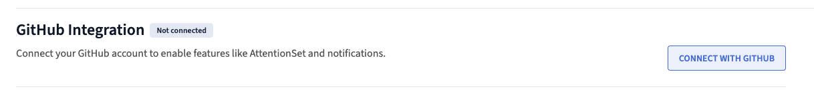
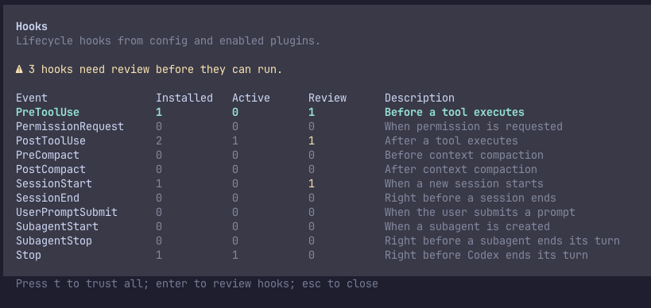
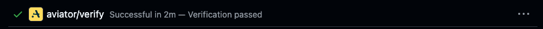

# Setting up your team

Getting a team onto Verify has two halves. One admin runs `aviator init` once per repository, which turns on agent hooks for everyone who works in it. Then each engineer connects their GitHub account and sets up the CLI and the `/verify-submit` skill on their own machine.

This page covers both. Part 2 is written to be shared with your team as-is.

**Before you start:** the repository needs to be connected to Verify. See [Connect a repository](how-to-guides/connect-a-repository.md).

## Part 1: The admin, once per repository

### 1. Install the CLI

```bash
brew trust aviator-co/tap
brew install aviator-co/tap/aviator
```

`brew trust` is needed on Homebrew 6 and later, which only loads third-party taps you've trusted. On Linux, install the `.deb` or `.rpm` from the [releases page](https://github.com/aviator-co/aviator-cli/releases).

### 2. Run `aviator init` from a clone of the repo

```bash
aviator init
```

If you aren't signed in yet, it offers to sign you in first, which opens your browser and stores the session in your OS keychain.

<figure><figcaption><p><code>init</code> offers a sign-in when it can't find credentials</p></figcaption></figure>

Then it asks which agents to set up. Select every agent used in this repository, not just the one you use. The configuration is committed, so it covers your whole team.

<figure><figcaption><p>Select every agent used in the repository</p></figcaption></figure>

### 3. Commit what it writes

`init` writes `.claude/settings.json` for Claude Code and `.codex/hooks.json` for Codex, then prints the exact git commands to put them on a branch. Run those and open the PR. Merging it is what turns the hooks on for everyone, and until then only your clone has them.

From then on, every agent session in this repo carries a standing instruction to capture intent and acceptance criteria before opening a PR, gets a nudge at commit time, and gets a last reminder if a PR command runs without a session. See [Set up agent hooks](how-to-guides/set-up-agent-hooks.md) for what each hook does and how to scope it to just yourself instead.

The hooks call the `aviator` binary. A teammate who doesn't have it gets told so at the start of their next session, along with how to install it, and the same happens if they have the CLI but aren't signed in. Nothing submits until Part 2 is done on their machine.

## Part 2: Everyone on the team

Four things, once per person. Share this section directly.

### 1. Connect your GitHub account

Open [Settings → Personal → Integrations](https://app.aviator.co/settings/personal/integrations). The GitHub card should read **Connected**. If it reads **Not connected**, click **Connect with GitHub**.

This is what ties your Aviator identity to your GitHub one. Without it your submissions still succeed, but the PR you open never links back to the session, so it never gets verified.

<figure><figcaption><p>Click <strong>Connect with GitHub</strong> when the card reads <strong>Not connected</strong></p></figcaption></figure>

### 2. Install the CLI

```bash
brew trust aviator-co/tap
brew install aviator-co/tap/aviator
```

`brew trust` is needed on Homebrew 6 and later. Linux users can grab the `.deb` or `.rpm` from the [releases page](https://github.com/aviator-co/aviator-cli/releases).

### 3. Sign in

```bash
aviator login
```

Everyone signs in as themselves. Submissions are attributed to whoever is signed in, so a shared credential collapses the audit trail.

### 4. Install the `/verify-submit` skill

The hooks tell your agent to run `/verify-submit`. The skill itself ships in the [Aviator agent plugins](https://github.com/aviator-co/agent-plugins), not in the CLI, so it needs installing separately.

In Claude Code:

```
/plugin marketplace add aviator-co/agent-plugins
/plugin install aviator@aviator-plugins
```

Codex users need two extra steps: install the `verify-submit` skill from the same repository, then run `/hooks` inside Codex and trust the Aviator hook. Codex won't fire a hook it hasn't been told to trust, so until you do, the config is in place but nothing happens. Trust is stored per person, so committing the hook doesn't carry it.

<figure><figcaption><p>Codex lists the three Aviator hooks as needing review until you trust them</p></figcaption></figure>

## Check that it works

Start a **fresh** agent session in the repo. Sessions already running when the hooks landed won't have the standing instruction, since it's delivered at session start.

Make a small change, then let the agent open a PR. You should see:

1. The agent runs `/verify-submit` on its own, or reminds you to. It drafts the intent and acceptance criteria with you and submits them.
2. The CLI prints a session URL like `https://app.aviator.co/r/218`. Opening it shows the criteria and, once the run starts, a verdict for each one.
3. The PR body opens with a `Runbook:` line pointing at that session.
4. The Aviator Verify check appears on the pull request.

<figure><figcaption><p>The <code>aviator/verify</code> check on the pull request</p></figcaption></figure>

For a walkthrough of what happens after that, see [Your first verification](your-first-spec.md).

## When something doesn't fire

| Symptom | Cause |
| --- | --- |
| The agent never mentions Verify | The session predates the hooks. Start a new one. |
| Nothing fires in Codex | The hook isn't trusted yet. Run `/hooks` in Codex. |
| `/verify-submit` isn't a command | The agent plugin isn't installed on this machine. |
| The agent says the CLI isn't installed | It isn't on `PATH` on this machine. Install it, step 2 above. |
| The agent says no credentials were found, or a submission fails on auth | Run `aviator login`. |
| The session exists but the PR never links to it | Your GitHub account isn't connected. Check Settings → Personal → Integrations. |
| The PR has no Verify check | The `Runbook:` line is missing from the PR body, or the repo isn't connected. See [Fixing verification failures](how-to-guides/fixing-verification-failures.md). |

## See also

* [Set up agent hooks](how-to-guides/set-up-agent-hooks.md), what each hook does, personal setup, and how to remove them
* [Aviator CLI](reference/cli.md), the full command surface
* [Your first verification](your-first-spec.md), a hands-on run through the whole loop
* [Connect a repository](how-to-guides/connect-a-repository.md)
* [Setting up org invariants](setting-up-org-invariants.md), the rules that apply to every change automatically
