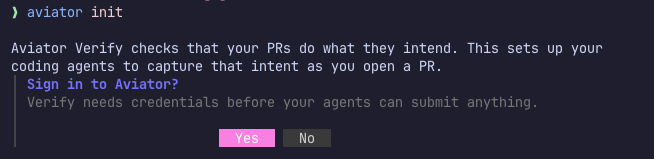
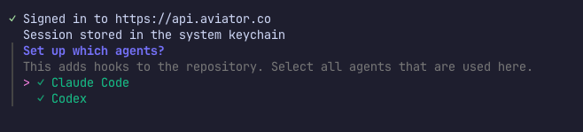

# Setting up your team

Getting a team onto Verify has two halves. An admin turns on agent hooks for everyone working in a given repository. Then each engineer connects their GitHub account and sets up the CLI and the Aviator skill on their own machine, which is covered in [Setting up your machine](setting-up-your-machine.md).

This page is the admin half.

**Before you start:**

* The repository needs to be connected to Verify. See [Connect a repository](how-to-guides/connect-a-repository.md).
* Everyone who will use Verify needs an invite to your company's Aviator workspace.

## 1. Install the CLI

```bash
brew trust aviator-co/tap
brew install aviator-co/tap/aviator
```

`brew trust` is needed on Homebrew 6 and later, which only loads third-party taps you've trusted. On Linux, install the `.deb` or `.rpm` from the [releases page](https://github.com/aviator-co/aviator-cli/releases).

## 2. Run `aviator init`

`cd` to the repository you're setting up, then:

```bash
aviator init
```

If you aren't signed in yet, it offers to sign you in first, which opens your browser and stores the session in your OS keychain.

<figure><figcaption><p><code>init</code> offers a sign-in when it can't find credentials</p></figcaption></figure>

Then it asks which agents to set up. Select every agent used by your team in this repository, not just the one you use. The configuration is committed, so it covers your whole team.

<figure><figcaption><p>Select every agent used in the repository</p></figcaption></figure>

## 3. Commit the hooks

`init` writes `.claude/settings.json` for Claude Code and `.codex/hooks.json` for Codex, then prints the git commands to put them on a branch. Run those and open the PR. Merging it turns the hooks on for everyone.

Support for other agents is coming. If your team uses a different one, email [howto@aviator.co](mailto:howto@aviator.co) and we'll send you the manual setup steps.

Every agent session in the repo then carries a standing instruction to capture intent and acceptance criteria before a PR, plus reminders at commit and PR time. None of it blocks. A teammate missing the CLI or a sign-in still commits and opens pull requests exactly as before, gets told what's missing at their next session start, and their changes simply don't reach Verify. See [Set up agent hooks](how-to-guides/set-up-agent-hooks.md) for the detail.

## 4. Send your team the setup steps

Everyone working in the repository sets up their own machine: [Setting up your machine](setting-up-your-machine.md).

## See also

* [Setting up your machine](setting-up-your-machine.md), the half your team does
* [Set up agent hooks](how-to-guides/set-up-agent-hooks.md), what each hook does and how to remove them
* [Connect a repository](how-to-guides/connect-a-repository.md)
* [Aviator CLI](reference/cli.md), the full command surface
* [Setting up org invariants](setting-up-org-invariants.md), the rules that apply to every change automatically
